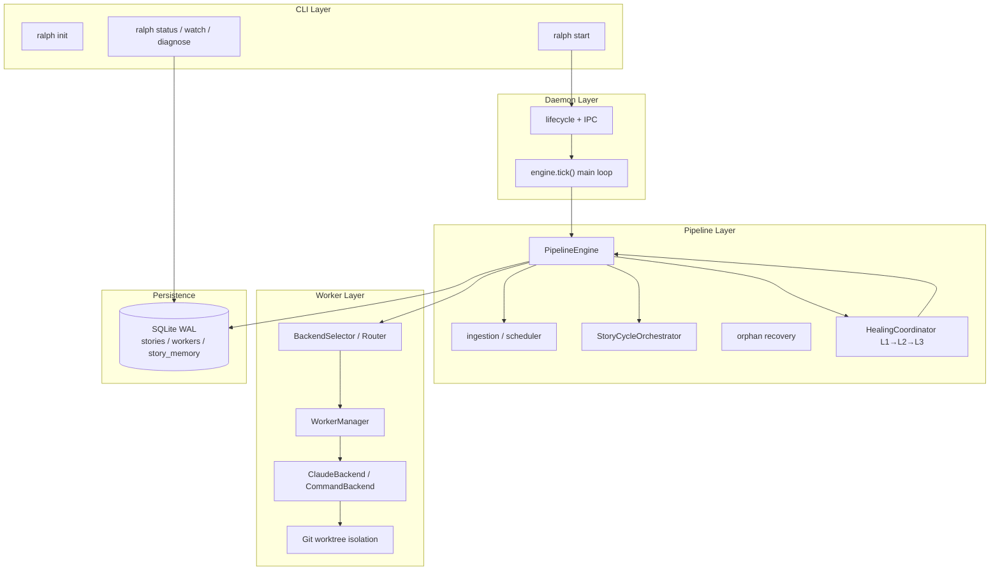

# Ralph

[中文](README.zh-CN.md) | English

Autonomous SDLC pipeline runner that orchestrates parallel Claude Code worker sessions in isolated git worktrees to execute BMAD stories with three-layer self-healing.

Ralph pairs with [BMAD-METHOD](https://github.com/bmad-code-org/BMAD-METHOD) for planning, shifting delivery from human-in-the-loop to human-on-the-loop.

## Prerequisites

| Dependency | Version / Notes |
|------------|-----------------|
| Python | 3.11+ |
| Node.js | 20.12+ (`ralph init` installs BMAD via `npx bmad-method install`) |
| Git | Required for worktree isolation |
| Claude Code CLI | Defaults to `claude`; override via environment variable |

## Installation

### From source (recommended for development)

```bash
git clone https://github.com/ykwylyyyn/bmad-ralph-auto.git
cd bmad-ralph-auto

# Editable install
pip install -e .

# Or run directly without installing
PYTHONPATH=src python -m ralph --help
```

### Shell completions (optional)

```bash
ralph completions bash >> ~/.bashrc
# or zsh / fish
ralph completions zsh  >> ~/.zshrc
ralph completions fish >> ~/.config/fish/completions/ralph.fish
```

## Quick Start

This workflow applies to **any target project** (not just this repository).

### 1. Initialize the project

From your project root:

```bash
cd /path/to/your-project
ralph init
```

`ralph init` creates:

```text
your-project/
├── ralph.toml                          # Project-level config
├── .ralph/                             # Runtime dir (daemon, DB, worktrees)
│   ├── logs/
│   └── worktrees/
├── _bmad/                              # BMAD install dir (created by npx bmad-method install)
├── _bmad-output/
│   ├── planning-artifacts/             # PRD, architecture, epics
│   └── implementation-artifacts/       # sprint-status.yaml, story files
├── .claude/skills/                     # BMAD v6+ skills (e.g. bmad-sprint-planning)
└── .ralph/bmad-pin.json                # BMAD install version record
```

`ralph init` runs `npx bmad-method install` to set up BMM + TEA modules. Node.js 20+ is required.

If you previously added the BMAD-METHOD **source repo** as a git submodule (error: `required planning workflow layout is missing`), recover with:

```bash
npx --yes bmad-method install --directory . --modules bmm,tea --tools claude-code --yes
```

Or run `ralph init` again (it will attempt recovery automatically).

### 2. Generate a sprint plan with BMAD

Run BMAD workflows in Claude Code following [WORKFLOW.md](WORKFLOW.md). Each sprint needs at minimum:

1. **Sprint Planning** (`/bmad-bmm-sprint-planning`) — produces `sprint-status.yaml`
2. **Create Story** (`/bmad-bmm-create-story`) — produces implementation specs per story

Key artifact paths:

```text
_bmad-output/implementation-artifacts/
├── sprint-status.yaml          # Auto-ingested on ralph start
├── 1-1-example-story.md        # Per-story spec files
└── ...
```

`sprint-status.yaml` must include a `development_status` mapping and optionally `story_location`.

### 3. Configure Claude Code

See [Claude Code setup](#claude-code-setup). **Ralph workers require permission bypass** in non-interactive `-p` mode.

```bash
export RALPH_CLAUDE_ARGS="--dangerously-skip-permissions"
```

### 4. Start the pipeline

```bash
ralph start
```

`ralph start` will:

1. Ensure project dirs and `.ralph/` runtime exist
2. Parse and ingest `_bmad-output/implementation-artifacts/sprint-status.yaml`
3. Persist stories and dependencies to SQLite (`.ralph/ralph.db`)
4. Launch the background daemon and schedule workers by dependency graph

### 5. Monitor and intervene

```bash
ralph status              # Snapshot: health, sprint progress
ralph status --detail     # Story and worker detail tables
ralph watch               # Live terminal dashboard (2s refresh default)
ralph watch --detail --refresh 5
ralph diagnose [STORY_ID] # Diagnostic report for failed stories
ralph retry STORY_ID      # Re-feed a corrected story into the pipeline
ralph stop                # Graceful daemon shutdown
```

## Claude Code setup

Ralph and BMAD both depend on the **Claude Code CLI**. Interactive BMAD work and autonomous Ralph workers need different permission settings.

### Install

```bash
npm install -g @anthropic-ai/claude-code
claude --version
claude update
```

See https://code.claude.com/docs/en/setup for the native installer.

### Authentication

```bash
claude auth login              # Claude subscription
claude auth login --console    # Anthropic Console API billing
claude auth status
```

Optional API key: `export ANTHROPIC_API_KEY=sk-ant-...`

### Interactive mode (BMAD manual steps)

```bash
cd /path/to/your-project
claude
```

| Scenario | Command |
|----------|---------|
| Default | `claude` |
| Plan-only (read-only) | `claude --permission-mode plan` |
| Auto-approve safe ops | `claude --permission-mode auto` |
| Skip all prompts | `claude --dangerously-skip-permissions` |

Press **Shift+Tab** in interactive mode to cycle permission modes.

### Permission modes

| Mode | Description | Use when |
|------|-------------|----------|
| `default` | Prompt for every write/exec | Learning, high-risk changes |
| `acceptEdits` | Auto-approve file edits | Day-to-day dev |
| `plan` | Read-only analysis | Architecture review |
| `auto` | Classifier approves safe ops | Efficient interactive dev |
| `bypassPermissions` | Skip prompts (`--dangerously-skip-permissions`) | **Isolated env / Ralph workers only** |

> **Security**: `bypassPermissions` lets Claude write files and run shell commands without confirmation. Ralph runs workers in isolated git worktrees, but do not use bypass on production checkouts.

### settings.json

User-level (`~/.claude/settings.json`):

```json
{
  "permissions": {
    "defaultMode": "acceptEdits",
    "allow": ["Bash(git *)", "Bash(pytest *)", "Bash(make *)"]
  }
}
```

For Ralph workers (user-level):

```json
{
  "permissions": {
    "defaultMode": "bypassPermissions"
  }
}
```

Project-level (`.claude/settings.json`):

```json
{
  "permissions": {
    "defaultMode": "auto"
  }
}
```

### Ralph worker environment variables

Ralph spawns Claude non-interactively (`claude -p --output-format json`). **Permission bypass is required** or workers hang waiting for prompts.

| Variable | Description | Example |
|----------|-------------|---------|
| `RALPH_CLAUDE_BIN` | Claude executable path | `/usr/local/bin/claude` |
| `RALPH_CLAUDE_ARGS` | Extra CLI flags for workers | `--dangerously-skip-permissions` |

```bash
export RALPH_CLAUDE_ARGS="--dangerously-skip-permissions"
ralph start
```

Effective worker command:

```text
claude --dangerously-skip-permissions -p --output-format json "<story prompt>"
```

### Verify

```bash
claude --dangerously-skip-permissions -p 'Reply with JSON: {"ok": true}'
tail -50 .ralph/logs/worker-1.log   # after ralph start
```

### Troubleshooting

| Symptom | Fix |
|---------|-----|
| `claude: command not found` | Install CLI or set `RALPH_CLAUDE_BIN` |
| Worker hangs with no output | Set `RALPH_CLAUDE_ARGS="--dangerously-skip-permissions"` |
| Auth failure | Run `claude auth login` |
| Bypass blocked on Linux | Do not run as root/sudo |

## Configuration

Ralph uses **three-tier config precedence** (highest to lowest):

```text
CLI flags  >  project ralph.toml  >  user ~/.config/ralph/ralph.toml  >  built-in defaults
```

### Project config `ralph.toml`

Generated by `ralph init`:

```toml
max_workers = 5
retry_limit = 3
```

| Field | Default | Description |
|-------|---------|-------------|
| `max_workers` | `5` | Maximum parallel workers |
| `retry_limit` | `3` | Self-healing Layer 1: max step retries before escalation |

#### Verifier gate (optional)

Disabled by default. When enabled, workers must pass objective checks before a story is marked `done`:

```toml
[verifier]
enabled = true
timeout_secs = 300
commands = ["make test-all"]
```

| Field | Default | Description |
|-------|---------|-------------|
| `verifier.enabled` | `false` | Enable verification gate |
| `verifier.commands` | `[]` | Commands run in story worktree (in order) |
| `verifier.timeout_secs` | `300` | Per-command timeout (seconds) |

Empty `commands` is treated as disabled (backward compatible).

#### Story cycle orchestration (optional)

Disabled by default (`enabled=false`). Legacy behavior: single dev worker + optional post-dev verifier.

When enabled, runs BMAD-equivalent phases in sequence (new Claude session per phase; worktree reused):

```toml
[story_cycle]
enabled = true
steps = ["dev", "verify"]
max_step_retries = 3
```

| Field | Default | Description |
|-------|---------|-------------|
| `story_cycle.enabled` | `false` | Enable multi-phase orchestration |
| `story_cycle.steps` | `["dev"]` | Phase sequence: `atdd`, `dev`, `verify`, `qa` |
| `story_cycle.max_step_retries` | `3` | Per-phase retry limit (Layer 1–3 healing) |

The `verify` step uses `[verifier]` commands (not Claude). Progress syncs to `sprint-status.yaml`.

#### Multi-model router (optional)

Without `[router]`, all workers use the Claude CLI (unchanged).

Route phases to different CLI backends:

```toml
[router]
default = "claude"

[router.backends.claude]
command = "claude"
args = ["--dangerously-skip-permissions"]

[router.backends.gemini]
command = "gemini"
args = ["-p"]
model = "gemini-pro"

[router.rules]
dev = "claude"
qa = "gemini"
```

`ralph status --detail` shows backend, model, and cost per story when available.

Overwrite existing config with `--force`:

```bash
ralph init --force --project-dir .
```

### User-level config

```bash
mkdir -p ~/.config/ralph
cat > ~/.config/ralph/ralph.toml <<'EOF'
max_workers = 3
EOF
```

User config provides global defaults; project `ralph.toml` overrides matching fields.

### CLI overrides

All subcommands support these global flags:

```bash
ralph --config /path/to/custom.toml \
      --user-config ~/.config/ralph/ralph.toml \
      --max-workers 8 \
      --project-dir /path/to/project \
      start
```

| Flag | Description |
|------|-------------|
| `--project-dir` | Target project root (default: cwd) |
| `--config` | Project config file path |
| `--user-config` | User config file path |
| `--max-workers` | Override `max_workers` |
| `--no-color` | Disable ANSI colors |
| `-q` / `--quiet` | Suppress non-essential output |
| `-v` / `--verbose` | Show additional detail |

### Environment variables

| Variable | Description |
|----------|-------------|
| `RALPH_CLAUDE_BIN` | Path to Claude Code executable (default: `claude`) |
| `RALPH_CLAUDE_ARGS` | Extra Claude CLI flags for workers (recommended: `--dangerously-skip-permissions`) |
| `RALPH_BMAD_MODULES` | BMAD modules to install (default: `bmm,tea`) |
| `RALPH_BMAD_TOOLS` | Target IDE tools (default: `claude-code`) |
| `RALPH_BMAD_NPM_PACKAGE` | npm package name (default: `bmad-method`) |
| `RALPH_BMAD_INSTALL_CHANNEL` | Set to `next` for `@next` prerelease |
| `RALPH_BMAD_SUBMODULE_URL` | Advanced/testing only: git submodule instead of npx |
| `NO_COLOR` | Any non-empty value disables color output |

## Architecture Design

Ralph turns BMAD planning artifacts (`sprint-status.yaml`, story specs) into a parallel autonomous delivery pipeline. Epics 8–11 evolve it into a full **Agent OS** with this core data flow:

```text
Router → Memory → State FSM → Worker → Verifier → (loop/heal)
```

### Overall Architecture



Dependency direction (unidirectional):

```text
cli.py → daemon/lifecycle.py → pipeline/engine.py
  ├── pipeline/scheduler.py, dependency_graph.py, ingestion.py
  ├── pipeline/orchestrator.py + story_cycle/config.py
  ├── pipeline/recovery.py, healing/coordinator.py
  ├── worker/manager.py → worker/backends/ (claude, command)
  ├── router/selector.py
  ├── memory/store.py, skill_loader.py, progress.py
  ├── verifier/runner.py
  └── common/db/store.py + schema.py
```

### Module Layers

| Layer | Directory | Responsibility |
|-------|-----------|----------------|
| CLI | `cli.py`, `init_project.py` | 7 subcommands: start / stop / status / diagnose / retry / init / watch |
| Daemon | `daemon/` | Background process lifecycle, Unix socket / loopback IPC |
| Pipeline | `pipeline/` | State machine, dependency scheduling, artifact ingestion, Story Cycle orchestration, orphan recovery |
| Self-healing | `pipeline/healing/` | Layer 1 step retry → Layer 2 worker restart → Layer 3 diagnose |
| Verifier | `verifier/` | Objective test / lint / build gates inside worktrees |
| Memory | `memory/` | Story progress, BMAD skill injection, phase artifact context |
| Router | `router/` | Select worker backend per Story Cycle step |
| Worker | `worker/` | Process spawning, health monitoring, worktrees, multi-backend abstraction |
| Observability | `status/`, `diagnose/`, `render/`, `watch/` | Terminal snapshots, diagnostic reports, live dashboard |
| Persistence | `common/db/` | SQLite schema, WAL mode, async access wrapper |
| Config | `config/` | Three-tier config: CLI flags > project `ralph.toml` > user defaults |

### Story State Machine

```text
                    ┌─────────────┐
                    │   QUEUED    │
                    └──────┬──────┘
                           │ scheduled
                           ▼
                    ┌─────────────┐
          ┌────────│ IN_PROGRESS │────────┐
          │        └──────┬──────┘        │
          │               │               │
     retry on fail   verifier on      direct complete
          │               │          (verifier off)
          │               ▼               │
          │        ┌─────────────┐          │
          │        │  VERIFYING  │          │
          │        └──────┬──────┘          │
          │          pass │ fail            │
          │               │                 ▼
          │               │          ┌─────────────┐
          └───────────────┼─────────►│  IN_REVIEW  │
                            │          └──────┬──────┘
                            ▼                 │
                       ┌─────────┐              │
                       │  DONE   │◄─────────────┘
                       └─────────┘

     BLOCKED ──(deps met)──► IN_PROGRESS
     FAILED  ──(ralph retry)──► QUEUED
```

| State | Meaning |
|-------|---------|
| `QUEUED` | Ingested, waiting for scheduling (dependencies satisfied) |
| `IN_PROGRESS` | Worker executing the current Story Cycle step |
| `VERIFYING` | Worker finished; system runs objective verification commands |
| `IN_REVIEW` | Completion pending without verifier (legacy-compatible path) |
| `DONE` / `FAILED` / `BLOCKED` | Terminal or waiting on dependencies |

### Pipeline State

The daemon main loop maintains global `PipelineState`:

| State | Meaning |
|-------|---------|
| `IDLE` | Not started or no active stories |
| `RUNNING` | Normal scheduling and execution |
| `HEALING` | At least one story in Layer 1–3 self-healing |
| `COMPLETE` | All stories in the current sprint reached a terminal state |
| `PAUSED` / `FAILED` | Reserved for future use |

### Story Cycle Sub-phases (optional)

When `[story_cycle]` is enabled, each story runs multiple independent worker sessions in order:

```text
atdd → dev → verify → qa
         │      │      │
         │      │      └── Claude / Codex / Gemini (selected by Router)
         │      └── Verifier commands (no Claude)
         └── Implementation phase (default-only path)
```

- Per-step failures go through three-layer healing; context passes between steps via `MemoryStore` + skill injection
- The `verify` step reuses `[verifier]` configuration
- On completion, syncs `sprint-status.yaml` and optional `story-{key}-progress.md`

### Three-Layer Self-Healing

```text
Failure event
   │
   ▼
Layer 1: Step Retry ──► Retry current step in same worktree (retry_limit)
   │ exhausted
   ▼
Layer 2: Worker Restart ──► Destroy worktree, new branch, respawn worker
   │ exhausted
   ▼
Layer 3: Diagnose ──► Write diagnostic_reports, mark FAILED
```

`ralph diagnose <story_id>` and `ralph retry <story_id>` view Layer 3 reports and manually reset failed stories.

### Data Flow (single tick)

```text
engine.tick()
  1. recover_orphaned_stories()     # reclaim orphaned story / worker
  2. Load stories + dependency_graph
  3. scheduler picks schedulable stories (max_workers cap)
  4. BackendSelector picks backend for current step
  5. MemoryStore assembles prompt (progress + skills)
  6. WorkerManager.spawn_for_story()
  7. Poll worker exit → verifier / next cycle step / complete
  8. On failure → HealingCoordinator → may enter HEALING
  9. Persist pipeline_events, update sprint-status
```

### SQLite Table Responsibilities

| Table | Purpose |
|-------|---------|
| `stories` | Story metadata and current `state` |
| `story_dependencies` | Inter-story dependency edges |
| `workers` | Worker process, worktree path, health |
| `story_memory` | Story Cycle progress, completed steps, context key-values |
| `healing_attempts` | Self-healing attempt records per layer |
| `diagnostic_reports` | Layer 3 root-cause analysis and recommendations |
| `pipeline_state` | Global pipeline state (single row) |
| `pipeline_events` | Observable events: verification failures, state transitions |

### Optional Features vs Defaults

| Config section | Default | When enabled |
|----------------|---------|--------------|
| `[verifier]` | `enabled=false` | After worker success, enter `VERIFYING` and run command gates |
| `[story_cycle]` | `enabled=false`, `dev` only | Multi-phase BMAD-equivalent orchestration with Memory injection |
| `[router]` | unset / disabled | All workers use Claude; when enabled, route backends via `rules` |

**Backward compatible**: without these sections enabled, behavior matches legacy `ralph start` (single Claude worker, `IN_REVIEW → DONE`). See the Configuration section above for details.

## How It Works

End-to-end flow (see Architecture Design for detail):

```text
BMAD Sprint Plan
       │
       ▼
ralph start ──► Ingest sprint-status.yaml + story files
       │
       ▼
Daemon (engine.tick loop) ──► Dependency-aware parallel dispatch (max_workers)
       │
       ├── Router selects backend ──► Memory injects prompt
       ├── Worker (git worktree isolation) ──► Claude / other CLI executes story
       ├── Verifier gate (optional)
       └── Story Cycle multi-phase (optional)
       │
       ├── Layer 1: Step retry (retry_limit)
       ├── Layer 2: Worker restart (fresh worktree)
       └── Layer 3: Diagnose escalation (mark failed, generate report)
       │
       ▼
ralph status / watch ──► Developer monitoring (human-on-the-loop)
```

## Project Layout

### Target project (using Ralph)

```text
.
├── ralph.toml
├── .ralph/
│   ├── ralph.db            # SQLite state (WAL mode)
│   ├── ralph.pid
│   ├── daemon.json
│   ├── ralph.sock          # Unix socket IPC (or loopback fallback)
│   ├── logs/               # Worker output logs
│   └── worktrees/          # Isolated git worktrees
├── _bmad/                  # BMAD-METHOD submodule
└── _bmad-output/
    ├── planning-artifacts/
    └── implementation-artifacts/
        ├── sprint-status.yaml
        └── *.md            # Story spec files
```

### This repository (Ralph source)

```text
src/ralph/
├── cli.py                    # CLI entry (7 subcommands)
├── config/                   # TOML config (verifier / story_cycle / router)
├── daemon/                   # Process lifecycle and IPC
├── pipeline/
│   ├── engine.py             # PipelineEngine main loop
│   ├── scheduler.py          # Dependency-aware scheduling
│   ├── orchestrator.py       # Story Cycle sub-phase orchestration
│   ├── story_cycle/          # Multi-phase configuration
│   ├── recovery.py           # Orphan story / worker recovery
│   └── healing/              # Layer 1–3 self-healing
├── worker/
│   ├── manager.py            # Worker spawning and health monitoring
│   └── backends/             # ClaudeBackend / CommandBackend
├── router/                   # Multi-model backend selection
├── memory/                   # story_memory, skill injection, progress sync
├── verifier/                 # Objective verification gates
├── status/ / render/         # Terminal rendering and status snapshots
├── diagnose/ / retry/        # Layer 3 diagnostics and manual retry
├── planning/                 # BMAD install integration
└── watch/                    # Live dashboard

tests_python/                 # Python unit and integration tests
scripts/ci-local.sh           # Local CI reproduction
.github/workflows/ci.yml
```

## Developing in This Repository

### Clone and dependencies

```bash
git clone https://github.com/ykwylyyyn/bmad-ralph-auto.git
cd bmad-ralph-auto
pip install -e ".[dev]" 2>/dev/null || pip install -e .
```

### Running tests

```bash
# Python tests
make test-all

# Reproduce CI locally
./scripts/ci-local.sh
```

### Development workflow

1. Read [WORKFLOW.md](WORKFLOW.md) for BMAD + TEA step order
2. Check `_bmad-output/implementation-artifacts/sprint-status.yaml` for current sprint progress
3. Create a feature branch: `git checkout -b cursor/<name>-a391`
4. Implement the story; run `make test-all` before pushing
5. Open a PR; CI runs Python tests on `main`

### Useful dev commands

```bash
# Run CLI directly
PYTHONPATH=src python -m ralph --help
PYTHONPATH=src python -m ralph init --project-dir /tmp/ralph-demo

# Clean Python caches
make clean
```

## CLI Reference

```bash
ralph start      # Start daemon, ingest sprint plan, begin scheduling
ralph stop       # Graceful shutdown
ralph status     # Pipeline state, story progress, worker health
ralph watch      # Live terminal dashboard
ralph diagnose   # Diagnostic report for failed stories
ralph retry      # Re-feed corrected stories into the pipeline
ralph init       # Initialize project (config, BMAD, directory layout)
ralph completions bash|zsh|fish
```

## Troubleshooting

| Symptom | Fix |
|---------|-----|
| `No sprint plan found` | Run BMAD sprint planning first; ensure `_bmad-output/implementation-artifacts/sprint-status.yaml` exists |
| `claude: command not found` | Install Claude Code CLI or set `RALPH_CLAUDE_BIN`; see [Claude Code setup](#claude-code-setup) |
| Worker hangs / no output | Set `RALPH_CLAUDE_ARGS="--dangerously-skip-permissions"` |
| BMAD layout validation failed | Do not use the BMAD-METHOD source repo as a submodule in `_bmad/`; run `npx bmad-method install --directory . --modules bmm,tea --tools claude-code --yes` |
| `npm error Invalid or unexpected token` | Usually a broken Node/npm install on Windows (common with older nvm-windows). Reinstall [Node 20 LTS](https://nodejs.org), or upgrade nvm-windows to 1.1.11+ and run `nvm uninstall <ver>` then `nvm install <ver>` in an **Administrator** PowerShell; verify with `node -v` and `npm -v` before `ralph init` |
| Node.js missing | Install Node 20+, then re-run `ralph init` |
| Daemon already running | Run `ralph stop` before `ralph start` |
| Story failed | `ralph diagnose <ID>` for report; fix and `ralph retry <ID>` |

## Related Docs

- [WORKFLOW.md](WORKFLOW.md) — BMAD + TEA workflow execution sequence
- [CLAUDE.md](CLAUDE.md) — Architecture and coding conventions (for AI collaborators)
- `_bmad-output/planning-artifacts/` — PRD, architecture, epic planning artifacts

## License

MIT
