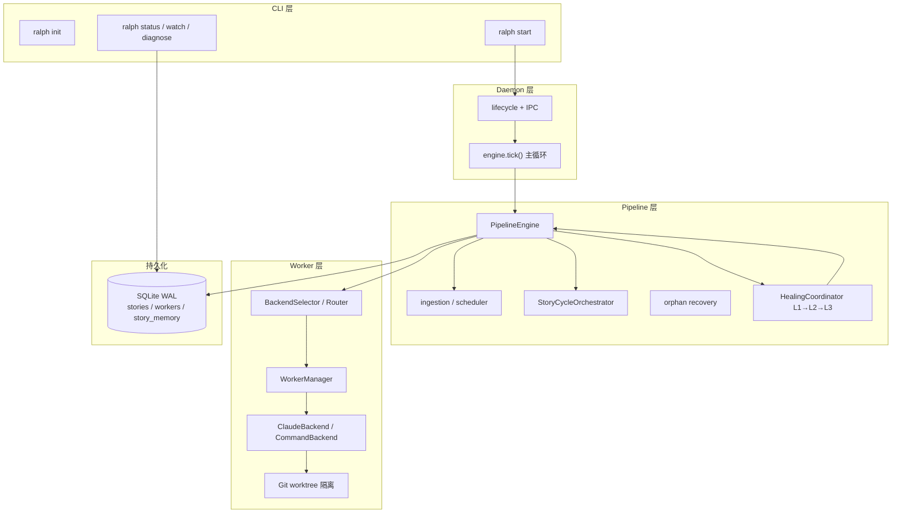

# Ralph

中文 | [English](README.en.md)

Ralph 是一个自主 SDLC 流水线运行器。它编排多个并行的 Claude Code worker 会话，在隔离的 git worktree 中执行 BMAD stories，并提供三层自愈能力。

Ralph 与 [BMAD-METHOD](https://github.com/bmad-code-org/BMAD-METHOD) 配合使用，把交付模式从 human-in-the-loop 转向 human-on-the-loop。

## 前置要求

| 依赖 | 版本 / 说明 |
|------|-------------|
| Python | 3.11+ |
| Node.js | 20.12+（`ralph init` 通过 `npx bmad-method install` 安装 BMAD） |
| Git | 用于 worktree 隔离 |
| Claude Code CLI | 默认命令为 `claude`，可通过环境变量覆盖 |

## 安装

### 从源码安装（推荐用于开发）

```bash
git clone https://github.com/ykwylyyyn/bmad-ralph-auto.git
cd bmad-ralph-auto

# 可编辑安装
pip install -e .

# 或直接从源码运行（无需安装）
PYTHONPATH=src python -m ralph --help
```

### Shell 补全（可选）

```bash
ralph completions bash >> ~/.bashrc
# 或 zsh / fish
ralph completions zsh  >> ~/.zshrc
ralph completions fish >> ~/.config/fish/completions/ralph.fish
```

## 快速开始

以下流程适用于**任意目标项目**（不限于本仓库本身）。

### 1. 初始化项目

在目标项目根目录执行：

```bash
cd /path/to/your-project
ralph init
```

`ralph init` 会创建：

```text
your-project/
├── ralph.toml                          # 项目级配置
├── .ralph/                             # 运行时目录（daemon、数据库、worktree）
│   ├── logs/
│   └── worktrees/
├── _bmad/                              # BMAD 安装目录（由 npx bmad-method install 生成）
├── _bmad-output/
│   ├── planning-artifacts/             # PRD、架构、Epic 等规划产物
│   └── implementation-artifacts/       # sprint-status.yaml、story 文件
├── .claude/skills/                     # BMAD v6+ skills（如 bmad-sprint-planning）
└── .ralph/bmad-pin.json                # BMAD 安装版本记录
```

`ralph init` 会自动运行 `npx bmad-method install` 安装 BMM + TEA 模块。需要已安装 Node.js 20+。

若之前误用 git submodule 安装了 BMAD 源码仓库（会出现 `required planning workflow layout is missing`），重新执行：

```bash
npx --yes bmad-method install --directory . --modules bmm,tea --tools claude-code --yes
```

或再次运行 `ralph init`（会自动尝试修复）。

### 2. 使用 BMAD 生成 Sprint Plan

在 Claude Code 中按 [WORKFLOW.zh-CN.md](WORKFLOW.zh-CN.md)（或 [WORKFLOW.md](WORKFLOW.md)）执行 BMAD 工作流。每个 sprint 至少需要：

1. **Sprint Planning**（`/bmad-bmm-sprint-planning`）— 生成 `sprint-status.yaml`
2. **Create Story**（`/bmad-bmm-create-story`）— 为每个 story 生成实现规格

关键产物路径：

```text
_bmad-output/implementation-artifacts/
├── sprint-status.yaml          # Ralph 启动时自动摄入
├── 1-1-example-story.md        # 各 story 的规格文件
└── ...
```

`sprint-status.yaml` 中需包含 `development_status` 映射，以及可选的 `story_location` 字段。

### 3. 配置 Claude Code

完成 [Claude Code 配置](#claude-code-配置)（安装、登录、权限模式）。**Ralph 自主 worker 必须跳过权限确认**，否则 `-p` 非交互模式会卡住。

```powershell
# Windows PowerShell — Ralph worker 推荐（在 ralph start 之前设置）
$env:RALPH_CLAUDE_ARGS="--dangerously-skip-permissions"
```

### 4. 启动流水线

```bash
ralph start
```

`ralph start` 会：

1. 确保项目目录与 `.ralph/` 运行时存在
2. 解析并摄入 `_bmad-output/implementation-artifacts/sprint-status.yaml`
3. 将 stories 与依赖写入 SQLite（`.ralph/ralph.db`）
4. 启动后台 daemon，按依赖关系并行调度 worker

### 5. 监控与干预

```bash
ralph status              # 快照：健康状态、sprint 进度
ralph status --detail     # 附加 story / worker 明细表
ralph watch               # 实时终端 dashboard（默认 2 秒刷新）
ralph watch --detail --refresh 5
ralph diagnose [STORY_ID] # 失败 story 的诊断报告
ralph retry STORY_ID      # 将修正后的 story 重新送入流水线
ralph stop                # 优雅停止 daemon
```

## Claude Code 配置

Ralph 与 BMAD 均依赖 **Claude Code CLI**。人工执行 BMAD 工作流与 Ralph 自主 worker 的配置方式不同。

### 安装

```powershell
# 方式 1：官方安装器（推荐）
# 见 https://code.claude.com/docs/en/setup

# 方式 2：npm 全局安装
npm install -g @anthropic-ai/claude-code

# 验证
claude --version
claude update          # 升级到最新版
```

### 登录与认证

```powershell
# 交互式登录（Claude 订阅账号）
claude auth login

# 使用 Anthropic Console API 计费
claude auth login --console

# 检查登录状态
claude auth status
claude auth status --text
```

**API Key 方式**（CI / 脚本，可选）：

```powershell
$env:ANTHROPIC_API_KEY="sk-ant-..."
claude auth status
```

> 首次 `claude auth login` 会打开浏览器完成 OAuth；无图形界面环境可用 `claude setup-token` 生成长效 token。

### 启动 Claude Code（交互式 — 用于 BMAD 人工步骤）

在项目根目录启动，以便加载 `.claude/skills/` 中的 BMAD skills：

```powershell
cd D:\project\xxx
claude
```

常用启动参数：

| 场景 | 命令 |
|------|------|
| 默认交互 | `claude` |
| 带初始提示 | `claude "帮我做 sprint planning"` |
| 计划模式（只读分析） | `claude --permission-mode plan` |
| 自动审批安全操作 | `claude --permission-mode auto` |
| 跳过所有权限确认 | `claude --dangerously-skip-permissions` |

交互模式中按 **Shift+Tab** 可循环切换权限模式（default → acceptEdits → plan → auto → bypassPermissions）。

### 权限模式说明

| 模式 | 说明 | 适用场景 |
|------|------|----------|
| `default` | 每次写文件/执行命令都需确认 | 学习、高风险改动 |
| `acceptEdits` | 自动批准文件编辑，命令仍需确认 | 日常开发 |
| `plan` | 只读分析，不修改文件 | 架构评审、方案讨论 |
| `auto` | 分类器自动批准安全操作，危险操作仍拦截 | 交互式高效开发（推荐） |
| `bypassPermissions` | 跳过权限确认（`--dangerously-skip-permissions`） | **仅隔离环境 / Ralph worker** |

> **安全提示**：`bypassPermissions` 会允许 Claude 自动写文件和执行 shell 命令。Ralph 已在 **git worktree 隔离目录** 中运行 worker，但仍请勿在生产主目录直接使用 bypass 模式。

### settings.json 持久化配置

用户级（所有项目生效）：

```powershell
# Windows
notepad $env:USERPROFILE\.claude\settings.json
```

```json
{
  "permissions": {
    "defaultMode": "acceptEdits",
    "allow": [
      "Bash(git *)",
      "Bash(pytest *)",
      "Bash(make *)"
    ]
  }
}
```

项目级（仅当前仓库，可提交到 git）：

```json
// .claude/settings.json
{
  "permissions": {
    "defaultMode": "auto"
  }
}
```

**Ralph 自主 worker 推荐**（用户级 `settings.json`，无需每次设环境变量）：

```json
{
  "permissions": {
    "defaultMode": "bypassPermissions"
  }
}
```

或使用 `dontAsk` + 白名单（CI 风格，更严格）：

```json
{
  "permissions": {
    "defaultMode": "dontAsk",
    "allow": [
      "Bash(git *)",
      "Bash(pytest *)",
      "Bash(pip *)",
      "Edit",
      "Write",
      "Read"
    ]
  }
}
```

### Ralph worker 专用环境变量

Ralph 以非交互方式调用 Claude（等效于 `claude -p --output-format json`）。**无人值守时必须配置权限**，否则 worker 会在权限提示处挂起并最终失败。

| 变量 | 说明 | 示例 |
|------|------|------|
| `RALPH_CLAUDE_BIN` | Claude 可执行文件路径 | `C:\Users\you\.local\bin\claude.exe` |
| `RALPH_CLAUDE_ARGS` | 追加到 `claude` 的 CLI 参数 | `--dangerously-skip-permissions` |

**Windows PowerShell（当前会话）**：

```powershell
$env:RALPH_CLAUDE_BIN="claude"
$env:RALPH_CLAUDE_ARGS="--dangerously-skip-permissions"
ralph start
```

**Windows 永久设置（用户环境变量）**：

```powershell
[System.Environment]::SetEnvironmentVariable(
    "RALPH_CLAUDE_ARGS", "--dangerously-skip-permissions", "User")
```

**Linux / macOS**：

```bash
export RALPH_CLAUDE_ARGS="--dangerously-skip-permissions"
# 或较安全的 auto 模式（需 Claude Code 2.1.111+）
export RALPH_CLAUDE_ARGS="--permission-mode auto"
ralph start
```

**等效命令行**（Ralph 实际 spawn 的形态）：

```text
claude --dangerously-skip-permissions -p --output-format json "<story prompt>"
```

### 验证 Claude Code 可被 Ralph 调用

```powershell
# 1. 非交互 + 跳过权限（与 Ralph worker 相同）
claude --dangerously-skip-permissions -p "Reply with JSON: {\"ok\": true}"

# 2. 查看 worker 日志（ralph start 后）
Get-Content .ralph\logs\worker-1.log -Tail 50
```

### 常见问题

| 现象 | 处理 |
|------|------|
| `claude: command not found` | 安装 Claude Code 并加入 PATH，或设置 `RALPH_CLAUDE_BIN` |
| Worker 卡住无输出 | 设置 `RALPH_CLAUDE_ARGS="--dangerously-skip-permissions"` |
| `auth` 失败 | 运行 `claude auth login`，检查网络与订阅/API 额度 |
| Linux 下 bypass 被拒绝 | 不要用 `sudo` 运行；bypass 禁止 root 执行 |
| 想限制 worker 权限 | 用 `--permission-mode dontAsk` + `settings.json` 的 `permissions.allow` 白名单 |

## 完整开发示例：用户管理系统

以下示例演示如何用 **BMAD + Ralph** 从零开发一个「用户管理系统」（注册、登录、资料管理、权限）。假设技术栈为 **Python FastAPI + SQLite + JWT**，你可按实际栈替换。

> 详细工作流说明见 [WORKFLOW.zh-CN.md](WORKFLOW.zh-CN.md)。每个 BMAD 步骤在 **新的 Claude Code 窗口** 中执行。

### 第 0 步：环境与项目初始化

```powershell
# 1. 安装 Ralph（在 bmad-ralph-auto 仓库中，见上文「安装」）
pip install -e .

# 2. 创建业务项目
mkdir D:\project\user-mgmt
cd D:\project\user-mgmt
git init

# 3. 初始化 Ralph + BMAD
ralph init
```

初始化后目录应包含 `ralph.toml`、`_bmad/`、`.claude/skills/bmad-sprint-planning` 等。

### 第 1 步：一次性规划（Phase 3）

在 Claude Code 中**按顺序**执行（每个命令开新窗口）：

| 顺序 | 在 Claude Code 中输入 | 目的 | 主要产物 |
|------|----------------------|------|----------|
| 1 | `bmad-help` 或 `/bmad-bmm-create-prd` | 明确产品需求 | `_bmad-output/planning-artifacts/prd.md` |
| 2 | `/bmad-bmm-create-architecture` | 技术架构（FastAPI、SQLite、JWT） | `architecture.md` |
| 3 | `/bmad-bmm-create-epics-and-stories` | 拆分 Epic | `epics.md` |
| 4 | `/bmad-tea-testarch-test-design` | 测试策略（可选） | `test-design-qa.md` |
| 5 | `/bmad-bmm-check-implementation-readiness` | 实现就绪检查 | 就绪报告 |
| 6 | `/bmad-tea-testarch-ci` | CI 流水线（可选） | `.github/workflows/ci.yml` |

**Epic 划分示例**（由步骤 3 产出，供参考）：

| Epic | 范围 |
|------|------|
| Epic 1 | 用户模型与认证（注册、登录、JWT） |
| Epic 2 | 用户资料 CRUD |
| Epic 3 | 角色与权限（RBAC） |
| Epic 4 | API 文档与运维监控 |

### 第 2 步：Sprint 规划（Phase 4）

```
/bmad-bmm-sprint-planning
```

告诉 SM：本 Sprint 聚焦 **Epic 1 — 用户模型与认证**，包含以下 Story：

| Story Key | 标题 | 依赖 |
|-----------|------|------|
| `1-1-user-model-and-schema` | 用户模型与数据库 Schema | 无 |
| `1-2-user-registration-api` | 用户注册 API | 1-1 |
| `1-3-user-login-and-jwt` | 登录与 JWT 签发 | 1-1 |
| `1-4-password-reset-flow` | 密码重置流程 | 1-2, 1-3 |

**生成的 `sprint-status.yaml` 示例**：

```yaml
development_status:
  epic-1: in-progress
  1-1-user-model-and-schema: backlog
  1-2-user-registration-api: backlog
  1-3-user-login-and-jwt: backlog
  1-4-password-reset-flow: backlog
  epic-1-retrospective: optional
```

### 第 3 步：单个 Story 的 9 步循环（以 Story 1-1 为例）

对 **每一个** Story 重复以下流程（详见 [WORKFLOW.zh-CN.md](WORKFLOW.zh-CN.md)）：

```text
┌─────────────────────────────────────────────────────────────┐
│  Story 1-1: 用户模型与数据库 Schema                            │
├─────────────────────────────────────────────────────────────┤
│  1. /bmad-bmm-create-story        → 1-1-user-model....md    │
│  2. /bmad-bmm-create-story (校验)  → 校验 Story 规格          │
│  3. /bmad-tea-testarch-atdd       → atdd-checklist-1-1.md   │
│  4. /bmad-bmm-dev-story           → 实现 models + migration │
│  5. /bmad-bmm-qa-generate-e2e-tests → 补充 E2E 测试          │
│  6. /bmad-bmm-code-review         → 代码评审（不通过则回 4）   │
│  7. /bmad-tea-testarch-test-review → 测试质量评分             │
│  8. /bmad-tea-testarch-nfr        → 安全/NFR（密码哈希等）     │
│  9. /bmad-tea-testarch-trace       → 追溯矩阵 + 门禁 Pass     │
└─────────────────────────────────────────────────────────────┘
```

**Story 1-1 验收标准示例**（写入 story 文件）：

- 定义 `User` 模型：`id`、`email`（唯一）、`password_hash`、`created_at`
- 提供 SQLite schema / migration
- 密码不得以明文存储
- 单元测试覆盖模型创建与唯一约束

**步骤 4 完成后本地验证**：

```bash
pytest tests/ -v
# 或项目 Makefile
make test-all
```

**Story 完成后更新 sprint 状态**：

```yaml
1-1-user-model-and-schema: done
1-2-user-registration-api: ready-for-dev
```

对其余 Story（1-2、1-3、1-4）重复相同 9 步循环。

### 第 4 步：启动 Ralph 自主执行（可选自动化）

当 Story 规格与 `sprint-status.yaml` 就绪后，可用 Ralph **并行调度** worker 执行 backlog 中的 Story：

```powershell
cd D:\project\user-mgmt

# 配置 Claude worker 权限（必须，否则 worker 会卡住）
$env:RALPH_CLAUDE_ARGS="--dangerously-skip-permissions"
claude --version

# 启动流水线
ralph start

# 实时监控
ralph watch --detail
```

**Ralph 执行时会发生什么**：

```text
sprint-status.yaml
    │
    ├─► Story 1-1（无依赖）──► Worker A @ worktree-A ──► claude 执行 dev-story
    ├─► Story 1-2（依赖 1-1）── 等待 1-1 Done 后调度
    └─► Story 1-3（依赖 1-1）── 可与 1-2 并行（若 max_workers ≥ 2）
```

**常用运维命令**：

```powershell
ralph status --detail          # 查看各 Story / Worker 状态
ralph diagnose 1001            # Story ID 对应 1-1（格式 epic*1000+story）
ralph retry 1002               # 修复后重试 Story 1-2
ralph stop                     # 停止 daemon
```

> Story ID 规则：`1-2-user-registration-api` → ID `1002`（epic 1，story 2）。

### 第 5 步：Sprint 收尾

1. 确认所有 Story 在 `sprint-status.yaml` 中为 `done`，且具备步骤 5–9 的质量产物
2. 可选：`/bmad-bmm-retrospective` 做 Epic 回顾
3. 下一 Sprint：重复 **第 2 步**，将 Epic 2（用户资料 CRUD）纳入规划

### 示例时间线总览

```text
Week 0  ralph init + BMAD 一次性规划（PRD、架构、Epic）
Week 1  Sprint Planning → Story 1-1 ~ 1-4 规格 + ATDD
        ralph start → 自动执行 / 人工监控
        质量门禁（CR、RV、NR、TR）→ 合并 PR
Week 2  Epic 2 Sprint Planning → 资料 CRUD Stories → 重复循环
```

### 人工 vs 自主分工建议

| 活动 | 建议方式 |
|------|----------|
| PRD、架构、Sprint 规划 | **人工** + BMAD（需要业务判断） |
| Story 规格、ATDD、代码评审 | **人工** + BMAD（质量把关） |
| 重复性 dev-story 实现 | **Ralph 自主** + 人工 `watch` 监控 |
| 合并 main、生产发布 | **人工** 审批 |

## 配置说明

Ralph 采用**三层配置优先级**（高到低）：

```text
CLI 参数  >  项目 ralph.toml  >  用户 ~/.config/ralph/ralph.toml  >  内置默认值
```

### 项目配置 `ralph.toml`

`ralph init` 生成的示例：

```toml
max_workers = 5
retry_limit = 3
```

| 字段 | 默认值 | 说明 |
|------|--------|------|
| `max_workers` | `5` | 并行 worker 上限 |
| `retry_limit` | `3` | 自愈 Layer 1：单步失败的最大重试次数 |

#### Verifier 门禁（可选）

默认关闭。启用后 worker 写完代码会跑客观校验，**通过才标 `done`**：

```toml
[verifier]
enabled = true
timeout_secs = 300
commands = ["make test-all"]
```

| 字段 | 默认值 | 说明 |
|------|--------|------|
| `verifier.enabled` | `false` | 是否启用验证门禁 |
| `verifier.commands` | `[]` | 在 story worktree 中依次执行的命令 |
| `verifier.timeout_secs` | `300` | 单条命令超时（秒） |

`commands` 为空时视为未启用（向后兼容）。

#### Story Cycle 多阶段编排（可选）

默认关闭（`enabled=false`），行为与旧版一致：单次 dev worker + 可选 verifier。

启用后可按 BMAD 等价阶段自动串联（每阶段独立 Claude session，worktree 跨阶段复用）：

```toml
[story_cycle]
enabled = true
steps = ["dev", "verify"]
max_step_retries = 3
artifacts_dir = "_bmad-output"
prompt_max_chars = 32000
```

| 字段 | 默认值 | 说明 |
|------|--------|------|
| `story_cycle.enabled` | `false` | 是否启用多阶段编排 |
| `story_cycle.steps` | `["dev"]` | 阶段序列：`atdd`、`dev`、`verify`、`qa` |
| `story_cycle.max_step_retries` | `3` | 单阶段失败重试上限（接入 Layer 1–3 自愈） |
| `story_cycle.artifacts_dir` | `_bmad-output` | BMAD 产物根目录 |
| `story_cycle.prompt_max_chars` | `32000` | prompt 字符上限（防超 context） |

`verify` 阶段使用 `[verifier]` 命令，不启动 Claude。阶段完成后会同步 `sprint-status.yaml` 与可选的 `story-{key}-progress.md`。

#### 多模型 Router（可选）

未配置 `[router]` 时，所有 worker 使用 Claude CLI（与旧版相同）。

按 story cycle 阶段路由到不同 CLI 后端（如 dev 用 Claude、qa 用 Codex/Gemini）：

```toml
[router]
default = "claude"

[router.backends.claude]
command = "claude"
args = ["--dangerously-skip-permissions"]

[router.backends.gemini]
command = "gemini"
args = ["-p"]
model = "gemini-pro"
output_format = "claude_json"

[router.rules]
dev = "claude"
qa = "gemini"
```

| 字段 | 说明 |
|------|------|
| `router.default` | 未命中规则时的默认后端名 |
| `router.backends.<name>.command` | 可执行文件 |
| `router.backends.<name>.args` | 固定参数列表 |
| `router.backends.<name>.model` | 展示用模型名（写入 status/diagnose） |
| `router.backends.<name>.output_format` | `claude_json`（默认）或 `plain` |
| `router.backends.<name>.append_prompt` | `true` 时将 prompt 作为末参数（自定义脚本） |
| `router.rules.<step>` | 阶段名 → 后端名（如 `dev`、`qa`） |

`ralph status --detail` 会显示每个 story 最近使用的 backend、model、cost（若 CLI JSON 输出含 `cost_usd`）。

使用 `--force` 可覆盖已有配置：

```bash
ralph init --force --project-dir .
```

### 用户级配置

```bash
mkdir -p ~/.config/ralph
cat > ~/.config/ralph/ralph.toml <<'EOF'
max_workers = 3
EOF
```

用户配置作为全局默认值；项目 `ralph.toml` 会覆盖同名字段。

### CLI 覆盖项

所有子命令均支持以下全局参数：

```bash
ralph --config /path/to/custom.toml \
      --user-config ~/.config/ralph/ralph.toml \
      --max-workers 8 \
      --project-dir /path/to/project \
      start
```

| 参数 | 说明 |
|------|------|
| `--project-dir` | 目标项目根目录（默认当前目录） |
| `--config` | 项目配置文件路径 |
| `--user-config` | 用户配置文件路径 |
| `--max-workers` | 覆盖 `max_workers` |
| `--no-color` | 禁用 ANSI 颜色 |
| `-q` / `--quiet` | 减少非必要输出 |
| `-v` / `--verbose` | 显示更多细节 |

### 环境变量

| 变量 | 说明 |
|------|------|
| `RALPH_CLAUDE_BIN` | Claude Code 可执行文件路径（默认 `claude`） |
| `RALPH_CLAUDE_ARGS` | 追加给 worker 的 Claude CLI 参数（推荐 `--dangerously-skip-permissions`） |
| `RALPH_BMAD_MODULES` | BMAD 安装模块列表（默认 `bmm,tea`） |
| `RALPH_BMAD_TOOLS` | BMAD 目标 IDE 工具（默认 `claude-code`） |
| `RALPH_BMAD_NPM_PACKAGE` | npm 包名（默认 `bmad-method`） |
| `RALPH_BMAD_INSTALL_CHANNEL` | 设为 `next` 使用 `@next` 预发布版 |
| `RALPH_BMAD_SUBMODULE_URL` | 仅测试/高级：用 git submodule 代替 npx 安装 |
| `NO_COLOR` | 设置任意非空值时禁用颜色输出 |

## 架构设计

Ralph 将 BMAD 规划产物（`sprint-status.yaml`、story 规格）转化为可并行执行的自主交付流水线。Epic 8–11 将其演进为完整的 **Agent OS** 架构，核心数据流为：

```text
Router → Memory → State FSM → Worker → Verifier → (loop/heal)
```

### 总体架构



依赖方向（单向）：

```text
cli.py → daemon/lifecycle.py → pipeline/engine.py
  ├── pipeline/scheduler.py, dependency_graph.py, ingestion.py
  ├── pipeline/orchestrator.py + story_cycle/config.py
  ├── pipeline/recovery.py, healing/coordinator.py
  ├── worker/manager.py → worker/backends/ (claude, command)
  ├── router/selector.py
  ├── memory/store.py, skill_loader.py, progress.py
  ├── verifier/runner.py
  └── common/db/store.py + schema.py
```

### 模块分层

| 层级 | 目录 | 职责 |
|------|------|------|
| CLI | `cli.py`, `init_project.py` | 7 个子命令：start / stop / status / diagnose / retry / init / watch |
| Daemon | `daemon/` | 后台进程生命周期、Unix socket / loopback IPC |
| Pipeline | `pipeline/` | 状态机、依赖调度、artifact 摄入、Story Cycle 编排、孤儿回收 |
| Self-healing | `pipeline/healing/` | Layer 1 步骤重试 → Layer 2 worker 重启 → Layer 3 diagnose |
| Verifier | `verifier/` | 在 worktree 内执行 test / lint / build 客观门禁 |
| Memory | `memory/` | story 进度、BMAD skill 注入、阶段产物上下文 |
| Router | `router/` | 按 Story Cycle 阶段选择 Worker 后端 |
| Worker | `worker/` | 进程孵化、健康监控、worktree、多后端抽象 |
| Observability | `status/`, `diagnose/`, `render/`, `watch/` | 终端状态快照、诊断报告、实时 dashboard |
| Persistence | `common/db/` | SQLite schema、WAL 模式、异步访问封装 |
| Config | `config/` | 三层配置：CLI flags > 项目 `ralph.toml` > 用户默认值 |

### Story 状态机

```text
                    ┌─────────────┐
                    │   QUEUED    │
                    └──────┬──────┘
                           │ 调度分配
                           ▼
                    ┌─────────────┐
          ┌────────│ IN_PROGRESS │────────┐
          │        └──────┬──────┘        │
          │               │               │
     失败重试        verifier 开启      直接完成
          │               │          (verifier 关闭)
          │               ▼               │
          │        ┌─────────────┐          │
          │        │  VERIFYING  │          │
          │        └──────┬──────┘          │
          │          通过 │ 失败            │
          │               │                 ▼
          │               │          ┌─────────────┐
          └───────────────┼─────────►│  IN_REVIEW  │
                            │          └──────┬──────┘
                            ▼                 │
                       ┌─────────┐              │
                       │  DONE   │◄─────────────┘
                       └─────────┘

     BLOCKED ──(依赖解除)──► IN_PROGRESS
     FAILED  ──(ralph retry)──► QUEUED
```

| 状态 | 含义 |
|------|------|
| `QUEUED` | 已摄入、等待调度（依赖已满足） |
| `IN_PROGRESS` | Worker 正在执行当前 Story Cycle 阶段 |
| `VERIFYING` | Worker 完成，系统执行客观验证命令 |
| `IN_REVIEW` | 无 verifier 时的完成待确认态（兼容旧行为） |
| `DONE` / `FAILED` / `BLOCKED` | 终态或等待依赖 |

### Pipeline 状态

Daemon 主循环维护全局 `PipelineState`：

| 状态 | 含义 |
|------|------|
| `IDLE` | 尚未启动或无活跃 story |
| `RUNNING` | 正常调度与执行 |
| `HEALING` | 至少一个故事正在 Layer 1–3 自愈 |
| `COMPLETE` | 当前 sprint 全部 story 已终态 |
| `PAUSED` / `FAILED` | 预留扩展 |

### Story Cycle 子阶段（可选）

启用 `[story_cycle]` 后，每个 story 按配置顺序执行多个独立 worker session：

```text
atdd → dev → verify → qa
         │      │      │
         │      │      └── Claude / Codex / Gemini（由 Router 选择）
         │      └── Verifier 命令（无 Claude）
         └── 实现阶段（默认仅此阶段）
```

- 每阶段失败走三层自愈；阶段间上下文通过 `MemoryStore` + skill 注入传递
- `verify` 阶段复用 `[verifier]` 配置
- 完成后同步 `sprint-status.yaml` 与可选的 `story-{key}-progress.md`

### 三层自愈

```text
失败事件
   │
   ▼
Layer 1: Step Retry ──► 同 worktree 内重试当前步骤（retry_limit）
   │ 耗尽
   ▼
Layer 2: Worker Restart ──► 销毁 worktree、新建分支、重新孵化 worker
   │ 耗尽
   ▼
Layer 3: Diagnose ──► 生成 diagnostic_reports，标记 FAILED
```

`ralph diagnose <story_id>` 与 `ralph retry <story_id>` 分别用于查看 Layer 3 报告与手动重置失败 story。

### 数据流（单次 tick）

```text
engine.tick()
  1. recover_orphaned_stories()     # 回收孤儿 story / worker
  2. 读取 stories + dependency_graph
  3. scheduler 选出可调度 story（max_workers 上限）
  4. BackendSelector 按当前 step 选后端
  5. MemoryStore 组装 prompt（progress + skills）
  6. WorkerManager.spawn_for_story()
  7. 轮询 worker 退出 → verifier / 下一 cycle step / 完成
  8. 失败 → HealingCoordinator → 可能进入 HEALING
  9. 持久化 pipeline_events、更新 sprint-status
```

### SQLite 表职责

| 表 | 用途 |
|----|------|
| `stories` | Story 元数据与当前 `state` |
| `story_dependencies` | Story 间依赖边 |
| `workers` | Worker 进程、worktree 路径、健康状态 |
| `story_memory` | Story Cycle 进度、已完成步骤、上下文键值 |
| `healing_attempts` | 自愈各层尝试记录 |
| `diagnostic_reports` | Layer 3 根因分析与建议 |
| `pipeline_state` | 全局 Pipeline 状态（单行） |
| `pipeline_events` | 验证失败、状态迁移等可观测事件 |

### 可选能力与默认行为

| 配置段 | 默认 | 启用后变化 |
|--------|------|-----------|
| `[verifier]` | `enabled=false` | Worker 成功后进入 `VERIFYING`，执行命令门禁 |
| `[story_cycle]` | `enabled=false`，仅 `dev` | 多阶段 BMAD 等价编排，Memory 注入 |
| `[router]` | 未配置 / 未启用 | 全部 worker 使用 Claude；启用后按 `rules` 路由后端 |

**向后兼容**：未启用上述配置时，行为与旧版 `ralph start` 一致（单 Claude worker、`IN_REVIEW → DONE`）。配置详情见上文「配置」章节。

## 工作方式

端到端流程概览（详见「架构设计」）：

```text
BMAD Sprint Plan
       │
       ▼
ralph start ──► 摄入 sprint-status.yaml + story 文件
       │
       ▼
Daemon（engine.tick 循环）──► 依赖感知并行分配（max_workers）
       │
       ├── Router 选后端 ──► Memory 注入 prompt
       ├── Worker（git worktree 隔离）──► Claude / 其他 CLI 执行 story
       ├── Verifier 门禁（可选）
       └── Story Cycle 多阶段（可选）
       │
       ├── Layer 1: 步骤重试（retry_limit）
       ├── Layer 2: Worker 重启（新 worktree）
       └── Layer 3: Diagnose 升级（标记 failed，生成报告）
       │
       ▼
ralph status / watch ──► 开发者监控（human-on-the-loop）
```

## 项目目录结构

### 目标项目（使用 Ralph 的项目）

```text
.
├── ralph.toml
├── .ralph/
│   ├── ralph.db            # SQLite 状态（WAL 模式）
│   ├── ralph.pid
│   ├── daemon.json
│   ├── ralph.sock          # Unix socket IPC（或 loopback 回退）
│   ├── logs/               # Worker 输出日志
│   └── worktrees/          # 隔离的 git worktree
├── _bmad/                  # BMAD-METHOD submodule
└── _bmad-output/
    ├── planning-artifacts/
    └── implementation-artifacts/
        ├── sprint-status.yaml
        └── *.md            # Story 规格文件
```

### 本仓库（Ralph 源码）

```text
src/ralph/
├── cli.py                    # CLI 入口（7 个子命令）
├── config/                   # TOML 配置解析（verifier / story_cycle / router）
├── daemon/                   # 进程生命周期与 IPC
├── pipeline/
│   ├── engine.py             # PipelineEngine 主循环
│   ├── scheduler.py          # 依赖感知调度
│   ├── orchestrator.py       # Story Cycle 子阶段编排
│   ├── story_cycle/          # 多阶段配置
│   ├── recovery.py           # 孤儿 story / worker 回收
│   └── healing/              # Layer 1–3 自愈
├── worker/
│   ├── manager.py            # Worker 孵化与健康监控
│   └── backends/             # ClaudeBackend / CommandBackend
├── router/                   # 多模型后端选择
├── memory/                   # story_memory、skill 注入、进度同步
├── verifier/                 # 客观验证门禁
├── status/ / render/         # 终端渲染与状态快照
├── diagnose/ / retry/        # Layer 3 诊断与手动重试
├── planning/                 # BMAD 安装集成
└── watch/                    # 实时 dashboard

tests_python/                 # Python 单元与集成测试
scripts/ci-local.sh           # 本地复现 CI
.github/workflows/ci.yml
```

## 在本仓库开发

### 克隆与依赖

```bash
git clone https://github.com/ykwylyyyn/bmad-ralph-auto.git
cd bmad-ralph-auto
pip install -e ".[dev]" 2>/dev/null || pip install -e .
```

### 运行测试

```bash
# Python 测试
make test-all

# 本地复现 CI
./scripts/ci-local.sh
```

### 开发工作流

1. 阅读 [WORKFLOW.zh-CN.md](WORKFLOW.zh-CN.md) 了解 BMAD + TEA 步骤顺序
2. 查看 `_bmad-output/implementation-artifacts/sprint-status.yaml` 确认当前 sprint 进度
3. 创建功能分支：`git checkout -b cursor/<name>-a391`
4. 实现 story，运行 `make test-all` 确认通过
5. 推送并创建 PR；CI 会在 `main` 上自动运行 Python 测试

### 常用开发命令

```bash
# 直接运行 CLI
PYTHONPATH=src python -m ralph --help
PYTHONPATH=src python -m ralph init --project-dir /tmp/ralph-demo

# 清理 Python 缓存
make clean
```

## CLI 参考

```bash
ralph start      # 启动 daemon，摄入 sprint plan 并开始调度
ralph stop       # 优雅停止
ralph status     # 流水线状态、story 进度、worker 健康
ralph watch      # 实时终端 dashboard
ralph diagnose   # 失败 story 诊断报告
ralph retry      # 将修正后的 story 重新送入流水线
ralph init       # 初始化项目（配置 + BMAD + 目录结构）
ralph completions bash|zsh|fish
```

## 故障排查

| 现象 | 处理 |
|------|------|
| `No sprint plan found` | 先运行 BMAD sprint planning，确保 `_bmad-output/implementation-artifacts/sprint-status.yaml` 存在 |
| `claude: command not found` | 安装 Claude Code CLI 或设置 `RALPH_CLAUDE_BIN`；见 [Claude Code 配置](#claude-code-配置) |
| Worker 卡住 / 无输出 | 设置 `RALPH_CLAUDE_ARGS="--dangerously-skip-permissions"` |
| BMAD 布局校验失败 | 勿将 BMAD-METHOD 源码仓库作为 submodule 放入 `_bmad/`；运行 `npx bmad-method install --directory . --modules bmm,tea --tools claude-code --yes` |
| `npm error Invalid or unexpected token` | 多为 Windows 上 Node/npm 安装损坏（常见于旧版 nvm-windows）。重装 [Node 20 LTS](https://nodejs.org)，或升级 nvm-windows 至 1.1.11+ 后以**管理员** PowerShell 执行 `nvm uninstall <版本>` 再 `nvm install <版本>`；用 `node -v`、`npm -v` 验证后再 `ralph init` |
| 缺少 Node.js | 安装 Node 20+ 后重新 `ralph init` |
| Daemon 已在运行 | 使用 `ralph stop` 后再 `ralph start` |
| Story 失败 | `ralph diagnose <ID>` 查看报告，修复后 `ralph retry <ID>` |

## 相关文档

- [WORKFLOW.zh-CN.md](WORKFLOW.zh-CN.md) — BMAD + TEA 工作流执行顺序（中文）
- [WORKFLOW.md](WORKFLOW.md) — BMAD + TEA workflow (English)
- [CLAUDE.md](CLAUDE.md) — 架构与编码约定（面向 AI 协作者）
- `_bmad-output/planning-artifacts/` — PRD、架构、Epic 规划产物

## 许可证

MIT
