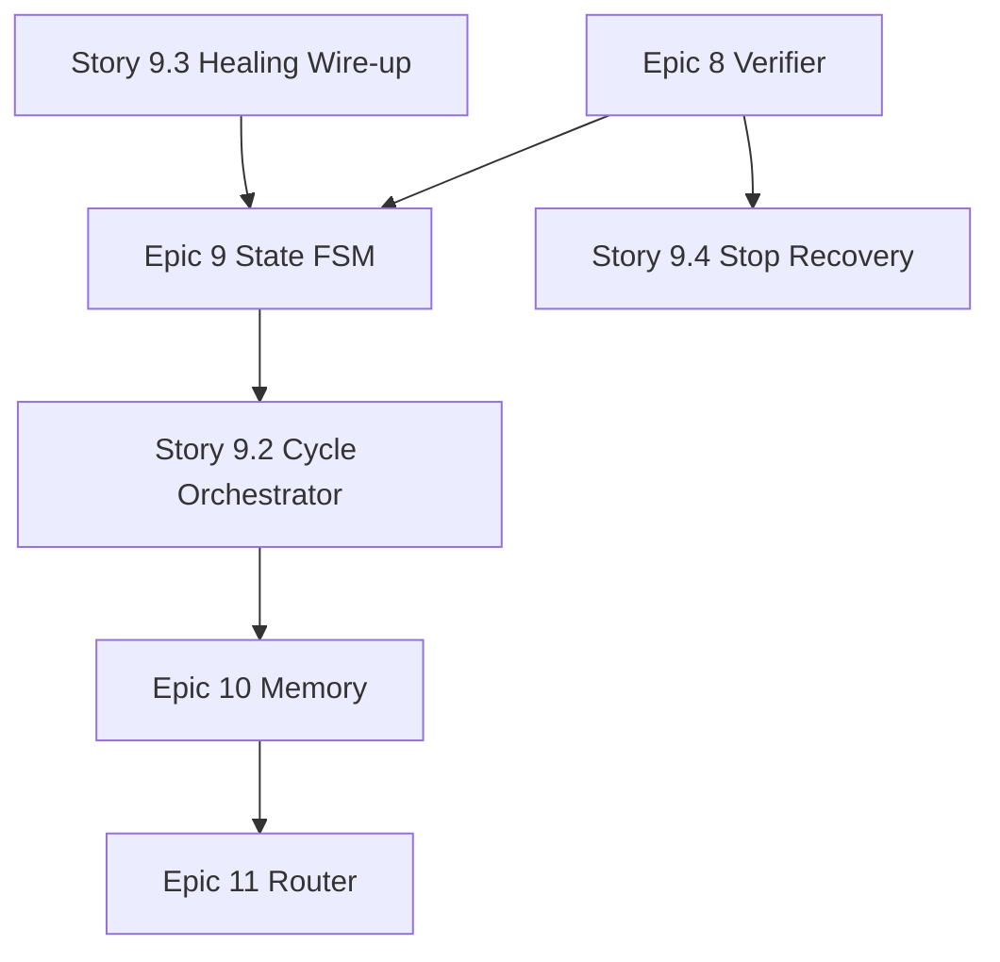

# Epic 8–11：自主 Agent OS 演进路线图

## 背景与目标

当前 Ralph 定位是 **并行 dev-story 执行器**（`QUEUED → IN_PROGRESS → IN_REVIEW → DONE`），成功判定依赖 Claude JSON 输出，**无客观验证门禁**、**无多模型路由**、**worker 不注入 BMAD skill**、**三层自愈未接入 `engine.tick()`**。

本路线图将 Ralph 演进为更接近完整自主 Agent OS 的架构：

```text
Router → Memory → State FSM → Worker → Verifier → (loop/heal)
```

## 现状差距摘要

| 能力 | 现状 | 目标 |
|------|------|------|
| State machine | `StoryState` 6 态；`IN_REVIEW` 无验证逻辑；`HEALING`/`PAUSED` 未使用 | `PENDING→RUNNING→VERIFYING→DONE` + Story 子阶段 |
| Verifier | 无 `test/lint/build` 门禁 | worker 完成后客观校验，失败触发重试/失败 |
| Router | 仅 `RALPH_CLAUDE_BIN` + `RALPH_CLAUDE_ARGS` | 按 step/Story 路由 Claude/Codex/Gemini |
| Memory | SQLite 状态 + worker 日志；skill 仅人工 Claude Code 使用 | progress + skill 片段 + 日志统一注入 worker |

## 实施原则

1. **增量交付**：每个 Epic 独立可测，不破坏现有 `ralph start` 行为（feature flag 默认 off）。
2. **BMAD 兼容**：读取 `_bmad-output/` 与 `.claude/skills/`，不硬编码 BMAD 内部步骤文件名。
3. **配置驱动**：`ralph.toml` 控制 verifier 命令、router 规则、memory 策略。
4. **零 unwrap**：延续项目错误处理约定；新模块用 crate 内 `thiserror` 枚举。

## 推荐实施顺序

```text
Epic 8  Verifier Gate          ← 最高 ROI，立刻提升可信度
Epic 9  Story Phase FSM        ← 依赖 Verifier 的 VERIFYING 阶段
Epic 10 Memory & Context       ← 提升 worker 质量
Epic 11 Multi-Model Router     ← 最后做，依赖前面稳定
```

---

## Epic 8：Verifier Gate（客观验证门禁）

**目标**：worker 完成实现后，自动执行可配置的 `test / lint / build / check`；仅全部通过才进入 `DONE`（或 `IN_REVIEW` 后的下一态）。

### Story 8.1：Verifier 配置与命令解析

**作为** 开发者，**我希望** 在 `ralph.toml` 中配置验证命令，**以便** 不同项目使用不同门禁。

**验收标准：**

- **Given** `ralph.toml` 含 `[verifier]` 段
- **When** 配置 `commands = ["make test-all"]` 或 `["pytest", "-q"]`
- **Then** `RalphConfig` 解析并暴露 `VerifierConfig`（命令列表、超时、`working_dir` 相对项目根）

**触及文件：**

- `src/ralph/config/config.py` — 新增 `VerifierConfig`
- `tests_python/test_config.py` — 配置解析测试

**估算**：小（~1 模块）

---

### Story 8.2：Verifier 执行器

**作为** pipeline，**我希望** 在隔离 worktree 中运行验证命令，**以便** 不污染主工作区。

**验收标准：**

- **Given** story 在 `worktree_path` 完成实现
- **When** `Verifier.run(worktree_path, config)` 被调用
- **Then** 依次执行配置的命令，捕获 stdout/stderr/exit_code，UTF-8 解码（Windows GBK 兼容，复用 `subprocess_util`）
- **And** 任一命令非零退出 → 返回 `VerifierResult(passed=False, failures=[...])`
- **And** 超时 → 返回结构化失败原因

**触及文件：**

- `src/ralph/verifier/__init__.py`（新建）
- `src/ralph/verifier/runner.py`
- `src/ralph/common/subprocess_util.py` — 复用
- `tests_python/test_verifier.py`

**估算**：中

---

### Story 8.3：Pipeline 集成 — VERIFYING 阶段

**作为** 开发者，**我希望** worker 成功后自动进入验证，**以便** 不再仅靠 Claude 自称成功。

**验收标准：**

- **Given** `verifier.enabled = true`（默认 **false** 保持向后兼容）
- **When** worker 完成且 Claude JSON `subtype=success`
- **Then** story 转入 `VERIFYING`（新状态，见 Epic 9）或复用 `IN_REVIEW` + 子状态 `phase=verifying`
- **When** verifier 全部通过
- **Then** `IN_REVIEW → DONE`（或 `VERIFYING → DONE`）
- **When** verifier 失败
- **Then** 记录 `pipeline_events`；转入 Layer 1 重试或 `FAILED`（可配置）

**触及文件：**

- `src/ralph/pipeline/engine.py` — `_handle_completion` 后挂 verifier
- `src/ralph/worker/manager.py` — 可选：prompt 末尾提示「实现后不要自称完成，等待系统验证」

**估算**：中

---

### Story 8.4：Verifier 结果展示与诊断

**作为** 开发者，**我希望** `ralph status --detail` 和 `ralph diagnose` 显示验证失败详情，**以便** 快速定位。

**验收标准：**

- **Given** verifier 失败
- **When** 运行 `ralph diagnose <STORY_ID>`
- **Then** 报告含：失败命令、exit code、stderr 摘要（末 N 行）
- **When** `ralph status --detail`
- **Then** story 显示 `verifying` 或 `verify-failed` 显示态

**触及文件：**

- `src/ralph/diagnose/snapshot.py`
- `src/ralph/status/snapshot.py`
- `src/ralph/common/db/schema.py` — 可选 `verification_runs` 表

**估算**：小–中

---

## Epic 9：Story Phase 状态机

**目标**：将单一 `dev-story` 执行扩展为可编排的子阶段；补齐 `VERIFYING`；接入已有 Layer 1–3 自愈。

### Story 9.1：扩展 Story 状态与子阶段模型

**作为** pipeline，**我希望** 显式区分 VERIFYING 与 IN_REVIEW，**以便** 状态语义清晰。

**验收标准：**

- **Given** 新枚举 `StoryState.VERIFYING` 或 `StoryPhase` 字段（`queued|running|verifying|review|done|failed`）
- **When** 状态迁移发生
- **Then** `VALID_TRANSITIONS` 更新：`IN_PROGRESS→VERIFYING→DONE|FAILED`
- **And** SQLite `stories` 表迁移（`phase TEXT` 列或扩展 `state`）
- **And** 旧数据库自动迁移脚本

**触及文件：**

- `src/ralph/common/models.py`
- `src/ralph/pipeline/state.py`
- `src/ralph/common/db/schema.py`
- `tests_python/test_common.py`, `test_persistence.py`

**估算**：中

---

### Story 9.2：Story Cycle 子阶段编排（可选步骤）

**作为** 开发者，**我希望** 配置每个 Story 自动执行哪些 BMAD 等价阶段，**以便** 减少人工 slash。

**验收标准：**

- **Given** `ralph.toml` `[story_cycle] steps = ["dev", "verify"]`（默认仅 `dev`）
- **When** 扩展为 `["atdd", "dev", "verify", "qa"]`
- **Then** engine 按序调度：每阶段独立 `claude -p` session（新上下文）
- **And** 阶段产物路径可配置（默认 `_bmad-output/`）
- **And** 每阶段失败走 Layer 1–3

**配置示例：**

```toml
[story_cycle]
enabled = false          # 默认 false，仅 dev+verify
steps = ["dev", "verify"]
max_step_retries = 3
```

**触及文件：**

- `src/ralph/pipeline/orchestrator.py`（新建）
- `src/ralph/pipeline/engine.py`
- `src/ralph/worker/prompt.py` — 按阶段生成 prompt

**估算**：大

---

### Story 9.3：接入三层自愈到 engine.tick()

**作为** 开发者，**我希望** Layer 1/2/3 在运行时真实生效，**以便** 与 README 描述一致。

**验收标准：**

- **Given** worker 失败或 verifier 失败
- **When** `retry_limit` 未耗尽
- **Then** `Layer1StepRetry` 在同 worker 重试
- **When** Layer 1 耗尽
- **Then** `Layer2WorkerRestart` 换 worktree 重跑
- **When** Layer 2 耗尽
- **Then** `Layer3Diagnose` 写 `diagnostic_reports`，story → `FAILED`
- **And** `PipelineState.HEALING` 在自愈期间设置

**触及文件：**

- `src/ralph/pipeline/engine.py` — 主集成点
- `src/ralph/pipeline/healing/*.py` — 已有，接线路由
- `tests_python/test_healing.py` — 补充 engine 集成测试

**估算**：中（代码已有，主要是接线）

---

### Story 9.4：Graceful stop 时 IN_PROGRESS 故事回收

**作为** 开发者，**我希望** `ralph stop` 后 IN_PROGRESS 的 story 正确回队，**以便** `ralph start` 不会卡住。

**验收标准：**

- **Given** daemon `shutdown()` 杀死 worker
- **When** stop 完成
- **Then** 所有 `IN_PROGRESS` story 回 `QUEUED`（或 `FAILED` 可配置）
- **And** 集成测试覆盖 stop→start 恢复

**触及文件：**

- `src/ralph/daemon/lifecycle.py`
- `src/ralph/pipeline/engine.py`
- `tests_python/test_daemon.py`

**估算**：小

---

## Epic 10：Memory & Context（progress + skill + logs）

**目标**：worker 执行前注入项目上下文、BMAD skill 摘要、历史进度与相关日志。

### Story 10.1：MemoryStore 抽象与 SQLite 后端

**作为** pipeline，**我希望** 统一读写 story 级上下文，**以便** 跨阶段/session 复用信息。

**验收标准：**

- **Given** `MemoryStore` 接口：`get_context(story_id)`, `append_event(story_id, event)`, `get_progress(story_id)`
- **When** 持久化
- **Then** 新表 `story_memory`（`story_id`, `key`, `value_json`, `updated_at`）
- **And** 与现有 `pipeline_events` 不重复造轮子（可引用 event id）

**触及文件：**

- `src/ralph/memory/store.py`（新建）
- `src/ralph/common/db/schema.py`

**估算**：中

---

### Story 10.2：Skill 片段注入

**作为** worker，**我希望** prompt 包含相关 BMAD skill 的路径与要点，**以便** 非交互 `claude -p` 也能遵循工作流。

**验收标准：**

- **Given** `.claude/skills/bmad-bmm-dev-story/SKILL.md` 存在
- **When** 构建 dev 阶段 prompt
- **Then** 注入：skill 路径、workflow 摘要（首 N 行或 `customize.toml` workflow 字段）、story `.md` 全文、ATDD checklist 路径（若存在）
- **And** prompt 总长度可配置上限（防止超 context）

**触及文件：**

- `src/ralph/memory/skill_loader.py`（新建）
- `src/ralph/worker/prompt.py`
- `src/ralph/planning/bmad.py` — 复用 skill 发现逻辑

**估算**：中

---

### Story 10.3：Progress 与 BMAD 产物同步

**作为** 开发者，**我希望** Ralph 进度与 `sprint-status.yaml` / BMAD `*-progress.md` 对齐，**以便** 人工与自动步骤可 Resume。

**验收标准：**

- **Given** story 阶段完成
- **When** `memory.sync_progress(story_key)` 调用
- **Then** 更新 `sprint-status.yaml` 对应 key 状态（`in-progress`/`review`/`done`）
- **And** 可选写入 `_bmad-output/test-artifacts/story-{key}-progress.md`（YAML frontmatter 与 BMAD Resume 兼容）

**触及文件：**

- `src/ralph/memory/progress.py`
- `src/ralph/pipeline/artifact/reader.py`

**估算**：中

---

### Story 10.4：日志关联与 diagnose 增强

**作为** 开发者，**我希望** diagnose 报告聚合 worker 日志 + verifier 输出 + healing 历史，**以便** 一次看清全貌。

**验收标准：**

- **Given** `ralph diagnose <ID>`
- **When** 报告生成
- **Then** 含：最近 worker log 摘要、verifier stderr、memory 中记录的 step 列表

**触及文件：**

- `src/ralph/diagnose/snapshot.py`
- `src/ralph/memory/store.py`

**估算**：小

---

## Epic 11：Multi-Model Router

**目标**：按 Story 阶段或配置将任务路由到不同后端（Claude / Codex / Gemini）。

### Story 11.1：WorkerBackend 抽象

**作为** 架构师，**我希望** worker .spawn 依赖接口而非硬编码 Claude，**以便** 扩展多后端。

**验收标准：**

- **Given** `WorkerBackend` Protocol：`spawn(worktree, prompt) -> SessionHandle`
- **When** 注册 `ClaudeBackend`（现有逻辑迁移）
- **Then** 所有测试通过，默认行为不变

**触及文件：**

- `src/ralph/worker/backends/base.py`（新建）
- `src/ralph/worker/backends/claude.py`
- `src/ralph/worker/manager.py`

**估算**：中

---

### Story 11.2：Router 配置与选择策略

**作为** 开发者，**我希望** 在 `ralph.toml` 按阶段指定后端，**以便** CR 用不同模型。

**验收标准：**

- **Given** 配置：

```toml
[router]
default = "claude"

[router.backends.claude]
command = "claude"
args = ["--dangerously-skip-permissions"]

[router.backends.codex]
command = "codex"
args = ["-p"]

[router.rules]
"dev" = "claude"
"review" = "codex"
```

- **When** orchestrator 调度 `review` 阶段
- **Then** 使用 `codex` 后端

**触及文件：**

- `src/ralph/router/selector.py`（新建）
- `src/ralph/config/config.py`

**估算**：中

---

### Story 11.3：Gemini / 自定义后端适配器

**作为** 开发者，**我希望** 添加 Gemini CLI 后端，**以便** 多 vendor 冗余。

**验收标准：**

- **Given** `router.backends.gemini` 配置
- **When** 规则命中
- **Then** 调用 `gemini` CLI（或 HTTP API 适配层），输出归一化为 `ClaudeResult` 同等结构
- **And** fake backend 用于测试（不调用真实 API）

**触及文件：**

- `src/ralph/worker/backends/gemini.py`
- `tests_python/fixtures/fake_gemini.py`

**估算**：中–大（取决于 CLI 稳定性）

---

### Story 11.4：Router 可观测性

**作为** 开发者，**我希望** status 显示每个 story 使用的后端与模型，**以便** 审计成本与质量。

**验收标准：**

- **Given** worker 完成
- **When** `ralph status --detail`
- **Then** 显示 `backend`, `model`, `cost_usd`（若 JSON 输出含）

**触及文件：**

- `src/ralph/status/snapshot.py`
- `src/ralph/common/db/schema.py` — `workers.backend` 列

**估算**：小

---

## 横切 Story（贯穿各 Epic）

### Story X.1：Feature flags 与向后兼容

- 所有新行为默认 **关闭**；`ralph.toml` 显式开启
- 现有 `make test-all` 160 项不退化

### Story X.2：文档更新

- `README.zh-CN.md` / `WORKFLOW.zh-CN.md` 更新架构图与配置说明
- 标注「自主 9 步 Story Cycle」为可选 `story_cycle.enabled`

### Story X.3：Windows 验证

- Verifier 在 PowerShell 下 UTF-8
- Router 多后端在 Windows 路径下测试

---

## 依赖关系图



## 里程碑建议

| 里程碑 | 包含 Story | 用户可见价值 |
|--------|-----------|-------------|
| **M1 — 可信完成** | 8.1–8.4, 9.1, 9.3 | `verifier.enabled=true` 后只有测试过才 done |
| **M2 — 稳定运行** | 9.4, X.1 | stop/start 不卡住；自愈真实生效 |
| **M3 — 少人工** | 9.2, 10.1–10.3 | 可配置多阶段自动编排 + skill 注入 |
| **M4 — 多模型** | 11.1–11.4 | CR/review 路由到不同后端 |

## 风险与缓解

| 风险 | 缓解 |
|------|------|
| Verifier 过慢拖垮并行度 | 异步 verify 队列；verifier 仅跑增量测试 |
| Skill 注入超长 prompt | 可配置截断；只注入 SKILL.md 摘要 |
| Codex/Gemini CLI 不稳定 | Backend 抽象 + fake 测试；Claude 保持 default |
| 9 步全自动质量下降 | 默认只开 `dev+verify`；CR/TR 保持人工或 `review` 后端 |

## 与现有 Epic 1–5 的关系

- **不替代** Epic 2（Story 执行）/ Epic 4（自愈）：本路线图 **补全未接线部分** 并向上延伸
- Epic 5（Planning Integration）的 skill 发现逻辑（`planning/bmad.py`）将被 Epic 10 复用
- 新 Epic 编号 **8–11**，避免与已交付 Epic 1–7 冲突

---

## 下一步行动（立即可做）

1. 评审本路线图，确认 M1 范围（建议先做 Epic 8 + Story 9.3）
2. 在 `sprint-status.yaml` 中加入 Epic 8 backlog
3. 创建 `8-1-verifier-config.md` implementation artifact 开工
