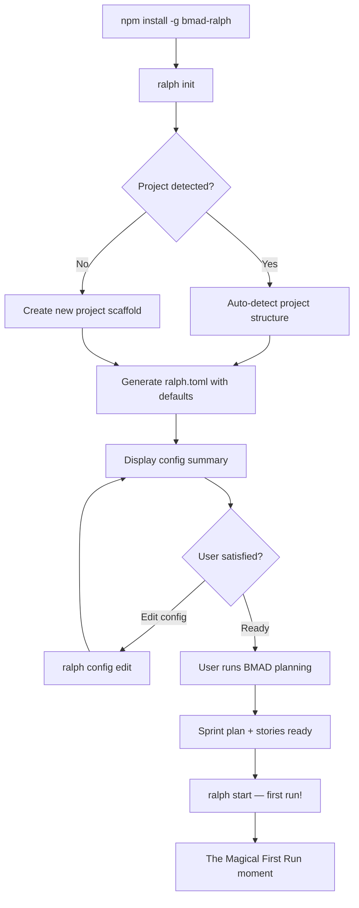
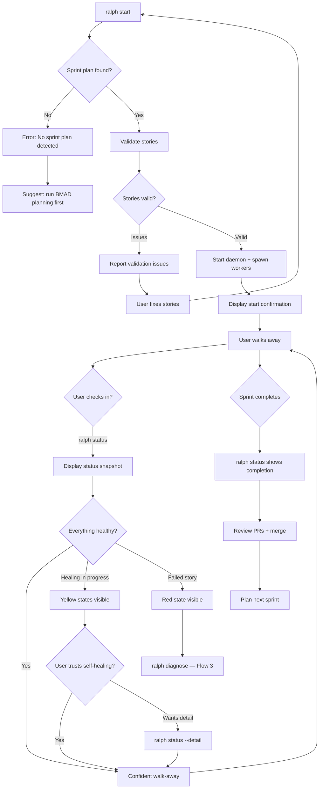
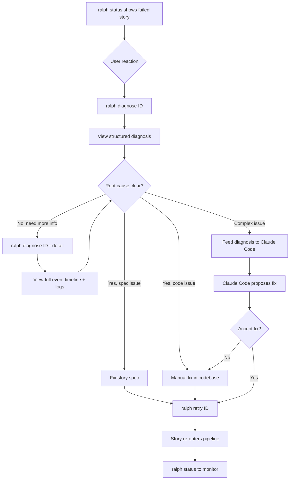

# UX Design Specification bmad-ralph

**Author:** Deadlock
**Date:** 2026-02-27

---

## Executive Summary

### Project Vision

bmad-ralph is a self-contained CLI tool that combines BMAD-METHOD's structured collaborative planning with Ralph's autonomous parallel execution pipeline. The core UX promise is the shift from human-in-the-loop to human-on-the-loop — users invest focused hours in high-quality planning, then agents execute stories 24/7 without human initiation. The signature experience is the "Wake Up Moment": returning to find implemented stories, passing tests, and PRs ready for review.

The interaction model is bifurcated into two distinct phases with fundamentally different UX requirements:
1. **Planning Phase (High-Touch):** Interactive collaboration with BMAD agents — conversational, iterative, requires deep engagement
2. **Execution Phase (Low-Touch):** Fire-and-forget with occasional monitoring — daemon management, status checks, error recovery

### Target Users

**Primary: Alex — Solo Full-Stack Developer**
- Works full-time during the day, builds side projects at night
- Spends 1-2 hours planning with BMAD, then starts Ralph and sleeps
- Tech-savvy, comfortable with CLI tools, expects standard terminal conventions
- Core need: AFK confidence — trust that work progresses without supervision
- Device: Terminal on laptop/desktop, occasional phone for PR review

**Primary: Sam — Small Team Tech Lead**
- Leads 5-10 person team, synthesizes multi-person planning input through BMAD
- Uses Ralph for sustained multi-day sprint execution
- Experienced developer, expects production-grade tooling behavior
- Core need: Throughput multiplication — team shifts from implementation to review
- Device: Terminal on development workstation

**Secondary: Non-Technical Stakeholders (PM, Designer)**
- Participate only in BMAD planning phase, never interact with Ralph CLI
- Not part of UX design scope for the execution pipeline

### Key Design Challenges

1. **AFK Confidence Through Terminal Output:** The `ralph status` command must deliver enough information in a single glance to answer "is everything okay?" while supporting deeper inspection when needed. The balance between information density and scannability is the central UX tension for the execution phase.

2. **Dual-Audience Error Recovery:** Diagnostic output must serve two consumers simultaneously — the human developer who needs to understand what failed and why, and Claude Code which needs structured context to propose fixes. The output format must be both human-readable and machine-parseable.

3. **Making Invisible Work Visible:** The daemon runs a complex state machine with parallel workers, multi-layer self-healing, and retry logic — all invisible to the user. The UX must surface enough of this internal complexity to build trust without overwhelming the user with implementation details.

### Design Opportunities

1. **Status Display as Trust Builder:** Every `ralph status` invocation is an opportunity to build or erode AFK confidence. A well-designed status display — with clear story progress, worker health, and self-healing state — becomes the product's signature experience and primary trust mechanism.

2. **Progressive Disclosure in Diagnostics:** A layered approach (summary → details → full logs) serves both the quick "what broke?" check and the deep investigative dive. This pattern can differentiate bmad-ralph from tools that dump raw logs or provide only opaque error codes.

3. **Onboarding as First Impression:** The `ralph init/setup` experience determines the user's initial trust trajectory. Minutes-to-productive is a KPI — the onboarding UX must deliver the "magical first run" experience described in User Journey 5 where the project appears to build itself.

## Core User Experience

### Defining Experience

The core experience of bmad-ralph centers on the **Execution Monitoring Loop**: `start → status → review`. Users interact with the tool through brief, purposeful CLI commands that provide immediate clarity about autonomous pipeline state. The most frequent interaction — `ralph status` — is the product's defining moment, answering "is everything okay?" in a single terminal output.

The product experience is bifurcated:
- **Planning Phase:** Deep, interactive collaboration with BMAD agents (high engagement, long sessions)
- **Execution Phase:** Brief, periodic check-ins with the Ralph daemon (low engagement, seconds per interaction)

The execution phase UX must optimize for the "check and walk away" pattern — users should gain full situational awareness in under 2 seconds of reading terminal output.

### Platform Strategy

- **Platform:** Command-line interface, terminal-only
- **Input:** Keyboard commands following standard CLI conventions (`ralph <command> [flags]`)
- **Output:** Human-readable terminal text with color-coded status categories (success/warning/error)
- **Terminal Assumptions:** Standard 80-120 column width, ANSI color support, no TUI framework
- **Shell Integration:** zsh and bash completion for commands, subcommands, and flags
- **No GUI/Web/Mobile:** MVP is terminal-exclusive; all UX decisions optimize for terminal interaction
- **Local Execution:** Self-contained, no cloud dependencies, no network requirements for core operation

### Effortless Interactions

1. **Starting Execution:** `ralph start` with zero required arguments — sensible defaults detect the sprint plan, spawn workers, and begin execution. No configuration ceremony needed for the common case.

2. **Health Checking:** `ralph status` returns a complete pipeline snapshot in under 2 seconds — story progress counts, worker health, active self-healing state, and daemon uptime — structured for instant scanning.

3. **Failure Understanding:** `ralph diagnose` produces structured diagnostic output that is simultaneously human-readable (clear narrative of what failed and why) and machine-parseable (structured format suitable for feeding to Claude Code for fix proposals).

4. **First-Time Setup:** `ralph init` on any project delivers a working configuration in minutes — the onboarding UX prioritizes speed-to-first-run over comprehensive configuration.

5. **Invisible Self-Healing:** Retry, restart, and diagnose flows operate automatically without user intervention. Users discover self-healing activity through status checks, not through alerts or interruptions.

### Critical Success Moments

1. **The Magical First Run (Journey 5):** The moment a new user runs `ralph start` and watches workers spawn and stories begin executing. This is when the product's promise becomes tangible — "my project is building itself."

2. **The Wake Up Moment (Journey 1):** The morning `ralph status` check revealing overnight progress — stories completed, tests passing, PRs ready. This is the product's signature experience and the primary driver of continued use.

3. **The First Failure (Journey 2):** The user's first encounter with a failed story. The UX must communicate "the system tried to fix this, here's what happened, here's how you can help" — building trust in the self-healing pipeline rather than eroding confidence.

4. **The Confident Check-In (Journey 3):** The late-night status check where everything is green and the user closes the terminal with confidence. This moment validates AFK trust and establishes the behavioral pattern of "start and walk away."

### Experience Principles

1. **Confidence at a Glance:** Every status display answers "is everything okay?" within 2 seconds of reading. Information hierarchy prioritizes: overall health → story progress → worker state → details. If a user needs more than a glance, progressive disclosure provides depth on demand.

2. **Zero-Ceremony Execution:** Starting, stopping, and monitoring Ralph requires zero configuration and zero mental overhead. Defaults work for the common case. Commands are short and memorable. No setup rituals between planning and execution.

3. **Transparent Autonomy:** The system operates autonomously but is never opaque. Users can see what is happening (active workers), what happened (completed stories, self-healing events), and what will happen next (queued stories, pending retries) — without being forced to look. Information is available, not pushed.

4. **Failure is Expected, Not Exceptional:** Self-healing (retry, restart, diagnose) is core pipeline behavior, not a fallback mechanism. The UX treats recovery attempts as normal operational state — visible in status but not alarming. Only fully exhausted failures (all three healing layers failed) escalate to demand user attention.

## Desired Emotional Response

### Primary Emotional Goals

The primary emotional goal of bmad-ralph is **confidence in absence** — the feeling that work is progressing reliably without supervision. Unlike tools where delight comes from active use, bmad-ralph's emotional success is measured by the user's willingness to walk away from the terminal and trust the system.

Supporting emotional goals:
- **Wonder at first run** — the visceral experience of watching a project build itself
- **Pride at morning review** — the satisfaction of waking up to meaningful, autonomous progress
- **Informed calm during failures** — the reassurance that the system tried to heal and provided clear guidance for what remains

### Emotional Journey Mapping

| Stage | Desired Emotion | Design Implication |
|-------|----------------|-------------------|
| Discovery | Curiosity and possibility | Clear, honest messaging about what Ralph delivers |
| First Setup | Impressed simplicity | Minimal required configuration, fast time-to-first-run |
| First Run | Wonder and excitement | Visible worker spawn activity, live progress indicators |
| Walking Away | Calm confidence | Status output that definitively answers "is it okay?" |
| Morning Check | Pride and satisfaction | Achievement-first framing — completed stories before issues |
| Encountering Failure | Informed calm | Narrative-structured diagnostics — what happened, what was tried, what to do |
| Returning Next Sprint | Eager anticipation | Clean session closures, satisfying completion summaries |

### Micro-Emotions

**Dominant Emotional Axis: Confidence ↔ Anxiety**
Every UX decision in the execution phase either builds or erodes user confidence in autonomous operation. This axis governs all design trade-offs.

**Critical Micro-Emotion Pairs:**
- **Confidence vs. Anxiety** — Status display must eliminate ambiguity; users should never wonder "is this good or bad?"
- **Trust vs. Skepticism** — Status accuracy is non-negotiable; the system must never report false positives or hide problems
- **Accomplishment vs. Frustration** — The Wake Up Moment must feel earned and repeatable, not like a lucky one-off

**Emotions to Actively Prevent:**
- **Helplessness** — failure with no guidance on next steps
- **Surveillance Anxiety** — compulsive status checking driven by uncertainty
- **False Confidence** — misleading status that erodes trust when reality diverges

### Design Implications

1. **Calm Confidence → Health-First Status:** Status output leads with a single overall health indicator (clear green/yellow/red semantic) before any detail. The user gets their answer in the first line.

2. **Informed Calm → Narrative Diagnostics:** Diagnostic output follows a structured narrative: what happened → what self-healing was attempted → what remains for the user to address. Never raw log dumps.

3. **Wonder → Visible First Run:** The first `ralph start` shows brief, live feedback of worker spawning and story assignment — the user witnesses agents coming to life. Concise, not noisy.

4. **Pride → Achievement-First Framing:** Status output always leads with progress (completed count, success rate) before listing problems. Positive framing without hiding issues.

5. **Trust → Absolute Accuracy:** Status never optimistically rounds or hides failures. If a story is retrying, it says "retrying." If it failed, it says "failed." Accuracy over comfort — this is the foundation of long-term trust.

6. **Eagerness → Clean Closure:** When a sprint completes, status shows a satisfying completion summary with aggregate statistics. The experience has a clear ending, motivating the user to plan the next sprint.

### Emotional Design Principles

1. **Accuracy Builds Trust:** Never sacrifice status accuracy for emotional comfort. Users will forgive failures they understand; they will not forgive a system that hid problems from them.

2. **Lead with the Answer:** Every output should front-load the information the user came for. Status leads with health. Diagnostics lead with the problem summary. Details follow for those who want depth.

3. **Normalize Recovery:** Self-healing activity is presented as routine, not alarming. "Story #5: retrying (attempt 2/3)" is matter-of-fact, not warning-colored. Only exhausted failures get elevated visual treatment.

4. **Celebrate Progress:** Completion statistics and success counts are always visible and prominent. The system acknowledges what went right, not just what went wrong.

## UX Pattern Analysis & Inspiration

### Inspiring Products Analysis

**1. Zellij (Terminal Workspace)**
Zellij demonstrates that terminal tools can achieve sophisticated UX without a GUI. Its bottom status bar provides ambient system state — users passively absorb information (active session, layout, mode) without issuing commands. The progressive discoverability model (keybinding hints shown by default, hideable once learned) proves that CLI tools can be simultaneously beginner-friendly and power-user efficient. Mode-based interaction with clear visual feedback (color-coded mode indicators) ensures users always know their current context.

**Key UX Insight:** Ambient information display in terminal eliminates the need for explicit status queries. Users know system state because it's always visible, not because they asked.

**2. Docker / Docker Compose (Container Lifecycle CLI)**
Docker's `docker ps` command is the benchmark for "pipeline status at a glance" — a compact table showing container name, status, ports, and uptime in a single scannable output. `docker logs` supports progressive disclosure with `--tail` and `--follow` flags, letting users choose their depth of investigation. The daemon model (dockerd) normalizes the pattern of a background process managed through CLI commands.

**Key UX Insight:** Tabular status output with consistent column structure enables instant pattern recognition across multiple managed entities.

**3. Kubernetes kubectl (Orchestration CLI)**
kubectl's status column uses concise, expressive state words (Running, CrashLoopBackOff, Pending, Completed) that communicate complex internal state in human terms. `kubectl describe` provides layered detail with an events timeline — a chronological narrative of what happened to a resource. This is the closest analog to Ralph's self-healing visibility need.

**Key UX Insight:** State words that encode both current status AND implied trajectory (CrashLoopBackOff implies repeated failure and retry) communicate more than simple status labels.

**4. GitHub CLI — gh (Modern Developer CLI)**
gh demonstrates zero-configuration intelligence — it detects the current repo, branch, and context automatically, eliminating setup ceremony. Output is human-readable by default with `--json` available for scripting. The tool follows the "do what I mean" principle: `gh pr view` without arguments shows the PR for the current branch.

**Key UX Insight:** Smart defaults that infer context eliminate the most common source of CLI friction — specifying what the tool should already know.

**5. PM2 (Node.js Process Manager)**
PM2's status table displays all managed processes with uptime, restart count, CPU, and memory in a single view. The visible restart count is particularly relevant — it normalizes restarts as routine operational events rather than failures. `pm2 logs` aggregates output from multiple processes with process-name prefixes for disambiguation.

**Key UX Insight:** Making restart counts visible and routine (not alarming) directly supports the "failure is expected, not exceptional" emotional design principle.

### Transferable UX Patterns

**Information Display Patterns:**

| Pattern | Source | Application to bmad-ralph |
|---------|--------|--------------------------|
| Ambient status bar | Zellij | Consider persistent status line during `ralph start` showing live daemon health without requiring `ralph status` |
| Tabular process overview | Docker, PM2 | `ralph status` story list as compact table: story ID, status word, worker, duration, retries |
| Expressive state words | kubectl | Story states that encode trajectory: "healing" (retry in progress), "blocked" (dependency), "exhausted" (all layers failed) |
| Smart context detection | gh | `ralph start` auto-detects sprint plan in project; `ralph status` auto-connects to running daemon |
| Progressive disclosure flags | Docker | `ralph status` compact by default; `ralph status --detail` for expanded view; `ralph status --story <id>` for single-story deep dive |

**Interaction Patterns:**

| Pattern | Source | Application to bmad-ralph |
|---------|--------|--------------------------|
| Progressive discoverability | Zellij | First-run hints showing available commands; hideable once user is proficient |
| Mode indicators | Zellij | Clear visual distinction between daemon states: starting, running, healing, idle, stopped |
| Zero-config defaults | gh | `ralph start` works without arguments on a properly planned project |
| Restart normalization | PM2 | Retry/restart counts displayed matter-of-factly in status table, not as warnings |

**Output & Visual Patterns:**

| Pattern | Source | Application to bmad-ralph |
|---------|--------|--------------------------|
| Color-coded hierarchy | Zellij | Consistent color semantics: green=healthy, yellow=healing, red=failed, dim=queued |
| Events timeline | kubectl | `ralph diagnose` includes chronological event log: what happened, when, what was tried |
| Process-prefixed logs | PM2 | Worker-prefixed output for multi-worker log viewing |

### Anti-Patterns to Avoid

1. **Wall-of-Text Logs (anti-kubectl verbose):** `kubectl logs` on a noisy pod produces unstructured output that requires manual grep. Ralph's diagnostic output must be structured and summarized, never raw log dumps.

2. **Cryptic State Codes:** Some tools use internal state codes (e.g., numeric exit codes as status) that require documentation to interpret. All Ralph states must be self-explanatory English words.

3. **Silent Failures:** Tools that fail silently or return success when partial failure occurred destroy trust. Ralph must never hide or downplay failures — accuracy over comfort.

4. **Configuration Ceremony:** Tools that require extensive config file editing before first use (looking at you, early Kubernetes) create onboarding friction. Ralph must work with zero config for the common case.

5. **Alarm Fatigue:** Tools that treat every retry or transient issue as a warning/error train users to ignore real problems. Ralph must reserve alarming visual treatment (red, exclamation marks) for genuinely exhausted failures only.

### Design Inspiration Strategy

**Adopt Directly:**
- **Tabular status display** (Docker/PM2 style) for story overview — compact, scannable, consistent columns
- **Expressive state words** (kubectl style) that encode both status and trajectory
- **Zero-config smart defaults** (gh style) for all common commands
- **Color-coded semantic hierarchy** (Zellij style) with consistent meaning across all outputs
- **Restart count normalization** (PM2 style) making retry counts visible but routine

**Adapt for bmad-ralph:**
- **Ambient status concept** (Zellij) — adapt from persistent status bar to a rich `ralph start` initial output that gives confidence before the user walks away, rather than requiring a follow-up `ralph status`
- **Events timeline** (kubectl describe) — adapt into Ralph's diagnostic narrative format: structured chronological account of what happened, what self-healing was attempted, and what remains
- **Progressive discoverability** (Zellij) — adapt as first-run hints in CLI output (e.g., "Tip: run `ralph status` to check progress anytime") that disappear after N uses

**Avoid:**
- Unstructured log dumps as diagnostic output
- Numeric/cryptic status codes
- Silent or hidden failures
- Mandatory pre-run configuration
- Warning-level treatment for routine self-healing events

## Design System Foundation

### Design System Choice

**Modern CLI Design System** — Color-coded terminal output with semantic formatting, tabular data displays, and progressive disclosure. No TUI framework; all output is standard terminal text with ANSI color support and graceful plain-text fallback.

This is the CLI equivalent of a "themeable system" — a consistent set of terminal output conventions that ensure visual coherence across all commands while remaining lightweight and compatible.

### Rationale for Selection

1. **Matches Platform Constraints:** PRD specifies "no TUI framework for MVP" and "human-readable terminal output" — Modern CLI delivers rich formatting within these bounds.
2. **Supports Core Experience Principle:** "Confidence at a Glance" requires instant visual scanning — color-coded semantic hierarchy (green/yellow/red) enables this in ways plain text cannot.
3. **Proven by Inspiration Sources:** Zellij, gh, Docker, PM2, and Claude Code all use this approach to great effect. Target users already expect this level of terminal sophistication.
4. **Graceful Degradation:** Auto-detects color support; falls back to structured plain text for piping and non-color terminals. Future JSON output (Phase 2) is additive, not disruptive.
5. **Solo Developer Feasibility:** Does not require a TUI framework dependency or complex rendering logic — achievable with standard terminal escape codes and a lightweight formatting library.

### Implementation Approach

**Terminal Output Components:**

| Component | Description | Usage |
|-----------|-------------|-------|
| Health Banner | Single-line overall status with color indicator | First line of `ralph status` — the "answer line" |
| Story Table | Compact tabular display with aligned columns | Story list in `ralph status` — the "detail view" |
| Worker Status Row | Inline worker health with uptime and assignment | Worker section in `ralph status` |
| Progress Summary | Completion counts with percentage | Header area of status output |
| State Words | Expressive, color-coded status labels | Status column in story table |
| Event Timeline | Chronological entries with timestamps | `ralph diagnose` output |
| Hint Line | Contextual tips for available actions | Footer of command output (first-run, dismissable) |
| Section Divider | Lightweight visual separator between output sections | Between status sections |
| Spinner | Activity indicator for in-progress operations | `ralph start` initial output, waiting states |

**Color Semantic System:**

| Color | Semantic | Usage |
|-------|----------|-------|
| Green | Healthy / Complete / Success | Completed stories, healthy workers, passing status |
| Yellow | Active / Healing / In-Progress | Stories being worked on, self-healing in progress, retrying |
| Red | Failed / Exhausted / Attention Needed | Exhausted failures only — reserved for genuine user-attention items |
| Dim/Gray | Queued / Inactive / Secondary | Queued stories, secondary information, timestamps |
| Bold | Headers / Emphasis / Key Data | Section headers, story counts, important values |
| Default | Normal body text | Descriptions, details, narrative content |

**State Word Vocabulary:**

| State Word | Color | Meaning |
|------------|-------|---------|
| completed | Green | Story finished successfully |
| running | Yellow | Worker actively executing story |
| queued | Dim | Waiting for available worker |
| blocked | Dim | Waiting on dependency |
| retrying | Yellow | Step retry in progress (Layer 1) |
| restarting | Yellow | Worker restart in progress (Layer 2) |
| diagnosing | Yellow | Diagnose flow active (Layer 3) |
| failed | Red | All healing layers exhausted — needs user attention |
| healthy | Green | Worker/daemon operating normally |
| idle | Dim | Worker available, no assignment |

### Customization Strategy

**Configuration-Driven Formatting:**
- Color output auto-detected via terminal capability check; overridable via `--no-color` flag and `NO_COLOR` environment variable (respecting the NO_COLOR standard)
- Output verbosity controlled via `--detail` flag for expanded view vs. compact default
- Future Phase 2: `--json` flag for machine-readable output

**Inspiration Integration Map:**

| Inspiration Source | Pattern Adopted | bmad-ralph Application |
|-------------------|----------------|----------------------|
| Zellij | Color-coded semantic hierarchy | Color Semantic System (green/yellow/red/dim) |
| Zellij | Progressive discoverability | Hint Lines with contextual tips, dismissable |
| Docker | Tabular process overview | Story Table component |
| kubectl | Expressive state words | State Word Vocabulary |
| gh | Zero-config smart defaults | Auto-detect sprint plan, daemon connection |
| PM2 | Restart count normalization | Retry count as routine column in story table |
| Claude Code | Streaming progress visibility | `ralph start` shows live worker spawn and initial story assignment |
| Claude Code | Compact tool display with expandable detail | Default compact status vs. `--detail` expanded view |
| Claude Code | Cost/resource tracking | Worker uptime, total execution time, story throughput in status |
| Claude Code | Spinner for active work | Activity spinner during daemon startup and command execution |

**Consistency Rules:**
- All commands follow the same color semantics — green always means healthy/success, red always means needs-attention
- All tabular output uses consistent column alignment and header formatting
- All commands support `--no-color` for plain text output
- State words are used identically across all commands — "retrying" means the same thing in `status` and `diagnose`

## Defining Experience

### The Core Interaction

**"Start Ralph, go to sleep, wake up to working code."**

The defining experience of bmad-ralph is the overnight execution loop: the user invests focused time in planning, starts the daemon with a single command, walks away with confidence, and returns to find meaningful autonomous progress. The product's value is proven not during active use, but during the user's absence.

The moment of truth is `ralph status` after an overnight run. This single command output either validates the product's entire promise or breaks it. Every UX decision ultimately serves this moment.

### User Mental Model

**Mental Model Shift Required:** From "AI as assistant" (I drive, AI helps) to "AI as workforce" (I plan, AI executes autonomously).

**Familiar Mental Models Users Bring:**
- **CI/CD Pipeline:** Configure → trigger → check results later. Closest analog — Ralph is a CI/CD pipeline that writes code instead of just validating it.
- **Build System:** Define targets and dependencies → run build → review output. Ralph applies this pattern at story-level granularity.
- **Process Manager (PM2, systemd):** Start daemon → it manages workers → check status periodically. Direct operational analog for the daemon interaction model.

**Key Mental Model Gaps:**
- **Trust in autonomous code generation:** Users accustomed to reviewing every AI-generated line will need time to trust overnight autonomous execution. The UX must build this trust incrementally.
- **Self-healing as normal:** Users expect failures to mean "something is wrong." Ralph's UX must reframe self-healing as routine pipeline behavior — retries are the system working correctly, not failing.
- **Intervention threshold:** Users need clear signals for when to intervene (exhausted failures) vs. when to let Ralph handle it (active self-healing). Status display must make this distinction unambiguous.

### Success Criteria

**The core interaction succeeds when:**

1. **Start-to-confidence in under 30 seconds:** From `ralph start` to "I can walk away now" — the user has seen enough output to trust the daemon is running correctly and working on the right stories.

2. **Status-to-answer in under 2 seconds:** From `ralph status` output appearing to "I know if everything is okay" — the health banner and progress summary deliver the answer before the user reads the story table.

3. **Zero required monitoring:** The system operates correctly whether the user checks status zero times or fifty times overnight. No user input is needed between `ralph start` and morning review.

4. **Failure clarity without investigation:** When a story fails, the status output communicates enough context (what story, what happened, what healing was tried) that the user knows their next action without running additional commands.

5. **Repeatable confidence:** The Nth overnight run builds the same confidence as the first successful run. Trust accumulates through consistent, accurate reporting — not through novelty.

### Novel UX Patterns

**Novel Pattern: Autonomous Trust Loop**
bmad-ralph introduces a UX pattern not common in developer tools — the "autonomous trust loop." The user's primary interaction is not *using* the tool but *trusting* it. The UX must:
- Build trust through transparent, accurate reporting (not through active engagement)
- Reward non-interaction (the best outcome is the user didn't need to check)
- Provide depth on demand without requiring depth by default

This pattern combines familiar elements (CI/CD status pages, process manager dashboards, daemon management) in a novel configuration where the "product experience" is primarily the user's *absence* from the tool.

**Established Patterns Leveraged:**
- **Daemon lifecycle management:** Start/stop/status is a well-understood CLI pattern
- **Tabular status display:** Users know how to read process/container tables
- **Color-coded health indicators:** Green/yellow/red is universal
- **Progressive disclosure:** Compact default → `--detail` → `--story <id>` follows familiar depth-on-demand conventions

### Experience Mechanics

**Phase 1 — Initiation (`ralph start`):**

| Step | System Behavior | User Sees |
|------|----------------|-----------|
| 1. Parse | Validate sprint plan and stories | Spinner → "Found sprint plan: 10 stories" |
| 2. Spawn | Start daemon, spawn workers | "Starting daemon... 3 workers spawning" |
| 3. Assign | First wave of story assignments | "Worker 1 → Story #1, Worker 2 → Story #2, Worker 3 → Story #3" |
| 4. Confirm | Daemon running, pipeline active | Health banner: "Ralph is running — 3 active, 7 queued" |
| 5. Hint | Contextual guidance | "Tip: `ralph status` to check progress anytime" |

**Phase 2 — Monitoring (`ralph status`):**

| Section | Content | Purpose |
|---------|---------|---------|
| Health Banner | "Ralph: healthy — running for 6h 42m" | Instant answer: is it okay? |
| Progress Summary | "Stories: 6 completed, 2 running, 1 retrying, 1 queued" | Quantified progress |
| Story Table | Compact table with ID, name, state, worker, duration, retries | Detail on demand |
| Worker Status | "Workers: 3/3 healthy" | Infrastructure health |
| Hint (first runs) | "Tip: `ralph status --detail` for expanded view" | Progressive discoverability |

**Phase 3 — Completion (`ralph status` on finished sprint):**

| Section | Content | Purpose |
|---------|---------|---------|
| Completion Banner | "Sprint complete — 9/10 stories delivered" | Celebration + honesty |
| Success Stats | "Success rate: 90% — 2 self-healed, 1 failed" | Aggregate achievement |
| Failed Summary | "Story #7: failed (exhausted) — run `ralph diagnose 7`" | Clear next action |
| Session Stats | "Total runtime: 8h 14m — 3 workers used" | Operational summary |

## Visual Design Foundation

### Color System

**ANSI Color Mapping:**

bmad-ralph uses semantic ANSI colors that work across both dark and light terminal themes. Colors are mapped to standard ANSI codes (not 256-color or true-color) for maximum terminal compatibility.

| Semantic | ANSI Color | Dark Theme | Light Theme | Usage |
|----------|-----------|------------|-------------|-------|
| Success/Healthy | Green (32) | Bright green on dark bg | Dark green on light bg | Completed stories, healthy status, passing |
| Active/Healing | Yellow (33) | Amber on dark bg | Dark yellow on light bg | Running, retrying, restarting, diagnosing |
| Failed/Attention | Red (31) | Bright red on dark bg | Dark red on light bg | Exhausted failures only |
| Secondary/Queued | Dim (2) | Muted on dark bg | Lighter on light bg | Queued, blocked, timestamps, hints |
| Emphasis | Bold (1) | Bold weight | Bold weight | Section headers, key counts, important values |
| Accent | Magenta (35) | Pink/magenta on dark bg | Purple on light bg | Border markers (※), special indicators |
| Default | Reset (0) | Terminal default | Terminal default | Body text, descriptions |

**Color Rules:**
- Never combine foreground colors (one semantic color per text span)
- Bold may combine with any semantic color for extra emphasis
- Dim is used for de-emphasis, never combined with color
- Red is reserved exclusively for exhausted failures — never for warnings or in-progress healing

**Theme Compatibility:**
- Use standard ANSI colors (not extended 256 or RGB) for maximum compatibility
- Respect `NO_COLOR` environment variable — disable all ANSI formatting when set
- Support `--no-color` CLI flag for explicit plain-text output
- Auto-detect color support via terminal capability check (isatty + TERM)

### Typography System

**Terminal Typography Hierarchy:**

All output is monospace (user's terminal font). Visual hierarchy is achieved through ANSI text attributes, not font choice.

| Level | Formatting | Usage | Example |
|-------|-----------|-------|---------|
| Section Header | Bold + Accent + Border | Major output sections | `※ Ralph ════════════ healthy ※` |
| Subsection | Bold | Column headers, labels | `Stories:`, `Workers:` |
| Key Value | Bold (value only) | Important metrics | `6 completed` |
| Body | Default | Descriptions, narrative | Story names, details |
| Secondary | Dim | Supplementary info | Timestamps, hints, inactive items |
| State Word | Color-coded | Status indicators | `completed`, `running`, `failed` |

**Text Conventions:**
- State words are always lowercase — `completed`, not `COMPLETED` or `Completed`
- Section labels use title case — `Story Table`, `Worker Status`
- Command references use backtick style in documentation, literal text in CLI output
- Numbers are always bold when they represent progress counts or metrics

### Spacing & Layout Foundation

**Terminal Layout Grid:**

| Parameter | Value | Rationale |
|-----------|-------|-----------|
| Minimum width | 80 columns | Standard terminal minimum |
| Comfortable width | 100-120 columns | Optimal for status table with all columns |
| Indentation | 2 spaces | Compact but readable; consistent throughout |
| Section gap | 1 blank line | Between major sections (Health Banner → Story Table → Workers) |
| Table column padding | 2 spaces | Between table columns for scannability |
| Border style | Zellij-inspired `═` with `※` markers | Section headers embedded in horizontal rule |

**Section Border Pattern (Zellij-Inspired):**

```
※ Section Name ══════════════════════════ context ※
  content indented 2 spaces under section border
  tabular data aligned with consistent column widths
```

- Top border only — no closing border (lightweight, not boxy)
- Section name embedded in the border line, breaking the `═` characters
- `※` markers as accent bookends (left for section, right for contextual status)
- Content indented 2 spaces under the border for visual grouping
- No border between individual rows — whitespace and alignment provide structure

**Output Density:**
- Default: Compact — optimized for "confidence at a glance" scanning
- `--detail` flag: Expanded — additional context per story, worker logs, event timeline
- Goal: Default status output fits within 20-25 terminal lines for a 10-story sprint

**Layout Principles:**
1. **Top-to-bottom priority:** Most important information (health, progress) at the top; details below
2. **Left-to-right scanning:** ID and status columns on the left (what the user needs first); duration and retries on the right (supplementary)
3. **Consistent alignment:** All tables use fixed-width columns across all commands — the story table looks identical in `status` and `diagnose`

### Accessibility Considerations

**Color Accessibility:**
- Never rely on color alone to convey information — state words provide text-based status alongside color
- Green/red distinction supported by accompanying text labels (`completed` vs. `failed`)
- `NO_COLOR` mode produces fully functional output with state words, alignment, and structure intact

**Screen Reader Compatibility:**
- Output uses plain text with consistent structure — no Unicode decorative characters in data (box-drawing only in borders)
- State words are human-readable English — screen readers can parse "completed", "running", "failed"
- Tabular data uses consistent column alignment — logical reading order from left to right

**Terminal Compatibility:**
- Standard ANSI escape codes only — no terminal-specific extensions
- Graceful degradation: color → bold/dim only → plain text (based on terminal capability)
- UTF-8 assumed for border characters (═, ※); ASCII fallback (=, *) if terminal lacks UTF-8 support

## Design Direction Decision

### Design Directions Explored

Four distinct visual directions were evaluated for bmad-ralph's terminal output:

1. **Minimal Clean (Docker-style):** Plain tabular output, no decoration. Maximum compatibility, minimal visual identity.
2. **Zellij-Inspired Structured:** Section borders with ※ markers and ═ lines, indented content blocks, clear visual hierarchy.
3. **Dashboard Dense (PM2-style):** Full box-drawing borders, progress percentage, maximum information density.
4. **Narrative + Compact Hybrid:** Prose-like health line, progress bar, list-style story display.

### Chosen Direction

**Direction 2 + 4 Hybrid: Zellij-Structured with Narrative Progress**

Combines Direction 2's distinctive section border system (※ markers, ═ lines, indented content) with Direction 4's narrative health line and visual progress bar.

**Key Elements:**
- **From Direction 2:** Zellij-inspired section borders (`※ Ralph ═══════ healthy ※`), tabular story/worker display with aligned columns, content indented under section borders
- **From Direction 4:** Natural-language health line ("Running for 6h 42m with 3 workers"), block-character progress bar, contextual hint line at footer

### Design Rationale

1. **Distinctive Identity:** The ※ border pattern gives bmad-ralph a recognizable visual signature — users of Zellij will feel instant familiarity, while others will perceive it as polished and intentional.
2. **Narrative Health Line Builds Confidence:** "Running for 6h 42m with 3 workers" is more immediately parseable than tabular metadata. It answers "what's happening?" in natural language before the user processes structured data.
3. **Progress Bar for Visceral Impact:** The visual progress bar provides an instant emotional signal — how far along is the sprint? — before the user reads any numbers. This directly serves the "Wake Up Moment" where seeing a nearly-full bar triggers pride and satisfaction.
4. **Tabular Detail for Depth:** Story and worker tables provide structured detail on demand, supporting the progressive disclosure pattern without sacrificing the narrative-first approach.

### Implementation Approach

**Output Components (Finalized):**

| Component | Style | Example |
|-----------|-------|---------|
| Section Border | `※ Name ═══════════ context ※` | `※ Ralph ════════════ healthy ※` |
| Health Line | Narrative sentence | `Running for 6h 42m with 3 workers` |
| Progress Bar | Two-tone block characters + percent | `██████████████████░░░░░░░░░░░░  60% completed` |
| Summary Line | Color-coded counts | `6 completed  2 running  1 retrying  1 queued` |
| Story Table | Aligned columns, indented | ID, Name, State, Worker, Duration, Retries |
| Worker Table | Compact inline | W1, health, assignment, uptime |
| Hint Line | Dim text, dismissable | `Tip: ralph status --detail for expanded view` |

**Progress Bar Specification:**
- Filled: `█` (U+2588) with Magenta/Accent (35) — progress uses accent color, not semantic green
- Empty: `░` (U+2591) with Dim (2) — low-contrast background
- Width: 30 characters fixed
- Label: percentage + "completed" in default text, right of bar
- Rationale: Progress ≠ Success; accent color preserves green's reserved meaning for health/state semantics. Two-tone style references Claude Code's progress bar pattern.

**Command Output Templates:**

**`ralph start`:**
```
※ Ralph ══════════════════════════════════ starting ※
  Found sprint plan: 10 stories, 3 dependencies mapped

  Starting daemon... done
  Spawning workers...
    W1 → Story #1 (Auth login flow)
    W2 → Story #2 (User dashboard)
    W3 → Story #3 (API rate limiting)

  Stories
  ░░░░░░░░░░░░░░░░░░░░░░░░░░░░░░  0% completed
  0 completed  3 running  7 queued

  Ralph is running — 3 workers active, 7 stories queued
  Tip: ralph status to check progress anytime
```

**`ralph status` (running):**
```
※ Ralph ════════════════════════════════════ healthy ※
  Running for 6h 42m with 3 workers

  Stories
  ██████████████████░░░░░░░░░░░░  60% completed
  6 completed  2 running  1 retrying  1 queued

※ Stories ═══════════════════════════════════════════════
  ID   Name                  State       Worker  Duration  Retries
  #1   Auth login flow       completed   —       12m 34s   0
  #2   User dashboard        completed   —       18m 02s   1
  #3   API rate limiting     running     W1      6m 11s    0
  #4   Email notifications   running     W2      3m 45s    0
  #5   Search indexing       retrying    W3      8m 22s    2
  #6   Data export           queued      —       —         0

※ Workers ══════════════════════════════════ 3/3 healthy ※
  W1   healthy   Story #3   uptime 6h 42m
  W2   healthy   Story #4   uptime 6h 42m
  W3   healthy   Story #5   uptime 6h 42m

  Tip: ralph status --detail for expanded view
```

**`ralph status` (complete):**
```
※ Ralph ═══════════════════════════════════ complete ※
  Sprint finished in 8h 14m with 3 workers

  Stories
  ███████████████████████████░░░  90% completed
  9 completed  1 failed

※ Stories ═══════════════════════════════════════════════
  ID   Name                  State       Duration  Retries
  #1   Auth login flow       completed   12m 34s   0
  #2   User dashboard        completed   18m 02s   1
  #3   API rate limiting     completed   9m 48s    0
  #4   Email notifications   completed   15m 22s   0
  #5   Search indexing       completed   11m 06s   2
  #6   Data export           completed   8m 33s    0
  #7   Payment webhook       failed      22m 18s   3 (exhausted)
  #8   User settings         completed   13m 41s   0
  #9   Audit logging         completed   7m 55s    1
  #10  Cache layer           completed   14m 55s   0

※ Summary ═══════════════════════════════════════════════
  Success: 90% — 2 self-healed, 1 failed
  Runtime: 8h 14m across 3 workers
  Failed: Story #7 — run ralph diagnose 7 for details
```

**`ralph diagnose <id>`:**
```
※ Diagnose ═══════════════════ Story #7: Payment webhook ※
  State: failed (exhausted — all 3 healing layers attempted)
  Duration: 22m 18s — 3 retries across 2 workers

※ Timeline ═════════════════════════════════════════════════
  22:14  Assigned to W2
  22:18  Step 3 (test execution) failed — assertion error
  22:18  Layer 1: step retry (attempt 1/3)
  22:22  Step 3 failed — same assertion error
  22:22  Layer 1: step retry (attempt 2/3)
  22:26  Step 3 failed — same assertion error
  22:26  Layer 2: worker restart — killed W2, spawned W2'
  22:28  Full story re-execution on fresh worker
  22:36  Step 3 failed — same assertion error
  22:36  Layer 3: diagnose flow triggered
  22:38  Diagnosis complete

※ Recommendation ═══════════════════════════════════════════
  Root cause: Acceptance criteria specifies "/api/v2/hooks" but
  story description references "/api/webhooks" — ambiguous endpoint path.

  Suggested fix: Clarify the endpoint path in story spec and re-feed:
    ralph retry 7
```

**`ralph status --detail` (expanded story view):**
```
※ Ralph ════════════════════════════════════ healthy ※
  Running for 6h 42m with 3 workers

  Stories
  ██████████████████░░░░░░░░░░░░  60% completed
  6 completed  2 running  1 retrying  1 queued

※ Story #5 ══════════════════════════ Search indexing ※
  State: retrying (Layer 1 — step retry, attempt 2/3)
  Worker: W3
  Duration: 8m 22s
  Branch: ralph/story-5-search-indexing

  Events:
  21:50  Assigned to W3
  21:54  Steps 1-2 completed (scaffold, implement)
  21:58  Step 3 (test execution) failed — timeout on index build
  21:58  Layer 1: step retry (attempt 1/3)
  22:02  Step 3 failed — timeout again
  22:02  Layer 1: step retry (attempt 2/3) ← current
```

## User Journey Flows

### Flow 1: Onboarding (Journey 5 — First-Time Setup)

**Entry Point:** Developer discovers bmad-ralph, installs CLI.
**Goal:** From install to first successful `ralph start` in minutes.



**CLI Interaction Sequence:**
```
$ ralph init

※ Ralph ═══════════════════════════════════════ setup ※
  Detected project: my-app (Node.js, git initialized)

  Creating ralph.toml...
    workers: 3
    retry_limit: 3
    sprint_plan: auto-detect
    log_level: info

  Setup complete in 4s

  Next steps:
    1. Plan your sprint with BMAD (create stories + sprint plan)
    2. ralph start to begin execution
    3. ralph status to check progress

  Tip: ralph config edit to customize settings
```

**Key UX Decisions:**
- Auto-detect project type → zero questions during init
- Sensible defaults written to TOML → user sees what was configured
- Clear "next steps" list → no ambiguity about what to do after init
- Total time: under 10 seconds from command to ready

### Flow 2: Execution & Monitoring (Journey 1 + 3 — Core Loop)

**Entry Point:** Sprint plan is ready, user runs `ralph start`.
**Goal:** Start daemon, walk away with confidence, return to results.



**CLI Interaction Sequence — Start:**
```
$ ralph start

※ Ralph ══════════════════════════════════ starting ※
  Found sprint plan: 10 stories, 3 dependencies mapped

  Starting daemon... done
  Spawning workers...
    W1 → Story #1 (Auth login flow)
    W2 → Story #2 (User dashboard)
    W3 → Story #3 (API rate limiting)

  Stories
  ░░░░░░░░░░░░░░░░░░░░░░░░░░░░░░  0% completed
  0 completed  3 running  7 queued

  Ralph is running — 3 workers active, 7 stories queued
  Tip: ralph status to check progress anytime
```

**CLI Interaction Sequence — Morning Check (100% success):**
```
$ ralph status

※ Ralph ════════════════════════════════════ healthy ※
  Running for 6h 42m with 3 workers

  Stories
  ██████████████████████████████  100% completed
  10 completed  0 running  0 queued

※ Summary ═══════════════════════════════════════════════
  Success: 100% — 1 self-healed, 0 failed
  Runtime: 6h 42m across 3 workers
  All stories delivered. PRs ready for review.
```

**Key UX Decisions:**
- `ralph start` validates before starting → no silent failures
- Start confirmation shows enough info to walk away confidently
- Morning `ralph status` leads with progress bar → instant emotional signal
- 100% completion gets celebration summary → "All stories delivered"

### Flow 3: Error Recovery (Journey 2 — Diagnose & Retry)

**Entry Point:** `ralph status` shows a failed story.
**Goal:** Understand failure, fix root cause, re-feed story — all with clear guidance.



**CLI Interaction Sequence — Diagnose:**
```
$ ralph diagnose 7

※ Diagnose ═══════════════════ Story #7: Payment webhook ※
  State: failed (exhausted — all 3 healing layers attempted)
  Duration: 22m 18s — 3 retries across 2 workers

※ Timeline ═════════════════════════════════════════════════
  22:14  Assigned to W2
  22:18  Step 3 (test execution) failed — assertion error
  22:18  Layer 1: step retry (attempt 1/3)
  22:22  Step 3 failed — same assertion error
  22:22  Layer 1: step retry (attempt 2/3)
  22:26  Step 3 failed — same assertion error
  22:26  Layer 2: worker restart — killed W2, spawned W2'
  22:28  Full story re-execution on fresh worker
  22:36  Step 3 failed — same assertion error
  22:36  Layer 3: diagnose flow triggered
  22:38  Diagnosis complete

※ Recommendation ═══════════════════════════════════════════
  Root cause: Acceptance criteria specifies "/api/v2/hooks" but
  story description references "/api/webhooks" — ambiguous endpoint path.

  Suggested fix: Clarify the endpoint path in story spec and re-feed:
    ralph retry 7
```

**CLI Interaction Sequence — Retry:**
```
$ ralph retry 7

※ Ralph ══════════════════════════════════ retrying ※
  Re-queuing Story #7 (Payment webhook)
  Assigned to W1

  Tip: ralph status to monitor progress
```

**Key UX Decisions:**
- Status output provides exact next command (`ralph diagnose 7`) → zero guesswork
- Diagnose follows narrative structure: state → timeline → recommendation
- Recommendation includes suggested command → user can act immediately
- `ralph retry` is a single command → minimal friction to re-feed
- Timeline shows all 3 healing layers were attempted → builds trust that system tried

### Journey Patterns

| Pattern | Description | Applied In |
|---------|-------------|-----------|
| **Command Chaining** | Every output suggests the logical next command | All flows — start→status, status→diagnose, diagnose→retry |
| **Validation Before Action** | Validate input before committing to execution | Start (validate plan), Retry (validate story) |
| **Narrative Error Context** | Errors include what happened, what was tried, what to do | Diagnose flow, failed status entries |
| **Progressive Depth** | Default compact → `--detail` → `--story <id>` | Status flow, diagnose flow |
| **Celebration on Success** | Positive framing when milestones are reached | Sprint completion summary, 100% bar |
| **Single-Command Recovery** | Recovery from any state requires at most one command | `ralph retry`, `ralph diagnose` |

### Flow Optimization Principles

1. **Minimum Steps to Value:** Every flow is designed for the fewest possible commands to achieve the user's goal. Onboarding: 2 commands (init, start). Monitoring: 1 command (status). Recovery: 2 commands (diagnose, retry).

2. **No Dead Ends:** Every output includes guidance for the next action. Error messages suggest fixes. Completion summaries suggest next workflows. No output leaves the user asking "now what?"

3. **Graceful Degradation of Flows:** If `ralph start` fails validation, it explains what's wrong and how to fix it. If `ralph diagnose` can't determine root cause, it provides the raw timeline for manual investigation. Every flow has a fallback path.

4. **Trust Through Transparency:** The error recovery flow explicitly shows all self-healing attempts in the timeline. Users see that the system tried multiple strategies before asking for help — this builds trust in the autonomous pipeline even when it fails.

## Component Strategy

### Terminal Output Components

All components in bmad-ralph's design system are terminal output primitives — reusable patterns for rendering structured information to the terminal. They compose together to form complete command outputs.

#### Component: Section Border

**Purpose:** Visually separate major output sections with distinctive branding.
**Usage:** Top of each logical section in command output.
**Anatomy:** `※` marker + section name + `═` fill + optional context + `※` marker
**States:**
- Default: `※ Ralph ════════════════════════════════ healthy ※`
- With status context: `※ Workers ══════════════════════ 3/3 healthy ※`
- Without context: `※ Timeline ═════════════════════════════════════`
**Behavior:** Border width auto-fills to terminal width (min 80, max 120). Section name and context are fixed; `═` characters fill remaining space.
**Color:** `※` markers in Magenta (35), section name in Bold, context colored by semantic meaning (green for healthy, red for failed, etc.), `═` in Dim (2).

#### Component: Health Line

**Purpose:** Communicate daemon state in natural language — the "answer line."
**Usage:** Immediately below the Ralph section border.
**Anatomy:** Narrative sentence describing current operational state.
**States:**
| Daemon State | Health Line | Color |
|-------------|-------------|-------|
| Starting | `Starting daemon... spawning 3 workers` | Yellow |
| Running | `Running for 6h 42m with 3 workers` | Default |
| Healing | `Running for 6h 42m — 1 story in recovery` | Yellow |
| Complete | `Sprint finished in 8h 14m with 3 workers` | Green |
| Stopped | `Stopped — was running for 6h 42m` | Dim |
| Error | `Daemon error — see ralph diagnose for details` | Red |
**Behavior:** Always one line. Duration auto-updates on each `status` query. Worker count reflects current active workers.

#### Component: Progress Bar

**Purpose:** Visceral, instant visual signal of sprint progress.
**Usage:** Below health line in status output.
**Anatomy:** Label + bar (filled █ + empty ░) + percentage
**Specification:**
- Width: 30 characters fixed
- Filled: `█` (U+2588) in Magenta/Accent (35)
- Empty: `░` (U+2591) in Dim (2)
- Label: `Stories` in Bold above bar
- Percentage: `60% completed` in Default, right of bar
**States:**
| Progress | Visual |
|----------|--------|
| 0% | `░░░░░░░░░░░░░░░░░░░░░░░░░░░░░░  0% completed` |
| 60% | `██████████████████░░░░░░░░░░░░  60% completed` |
| 100% | `██████████████████████████████  100% completed` |
**Behavior:** Bar fills proportionally. Percentage rounds to nearest integer. At 100%, entire bar is filled accent color.

#### Component: Summary Line

**Purpose:** Quantified breakdown of story states.
**Usage:** Below progress bar.
**Anatomy:** Count + state word pairs, space-separated.
**Format:** `6 completed  2 running  1 retrying  1 queued`
**Color per segment:**
| State | Count Color | Word Color |
|-------|------------|------------|
| completed | Bold | Green (32) |
| running | Bold | Yellow (33) |
| retrying | Bold | Yellow (33) |
| restarting | Bold | Yellow (33) |
| diagnosing | Bold | Yellow (33) |
| queued | Bold | Dim (2) |
| blocked | Bold | Dim (2) |
| failed | Bold | Red (31) |
**Behavior:** Only shows states with count > 0. States appear in fixed order: completed → running → healing states → queued → blocked → failed.

#### Component: Story Table

**Purpose:** Detailed per-story status display.
**Usage:** Under `※ Stories ═══` section border.
**Anatomy:** Header row + data rows, aligned columns.
**Columns:**
| Column | Width | Alignment | Content |
|--------|-------|-----------|---------|
| ID | 4 | Right | `#1`, `#7` |
| Name | 20 (truncate) | Left | Story name, truncated with `…` if needed |
| State | 11 | Left | State word, color-coded |
| Worker | 6 | Left | `W1`, `—` if none |
| Duration | 9 | Right | `12m 34s`, `—` if not started |
| Retries | 7 | Right | `0`, `3 (exhausted)` |
**State Word Colors:** Per color semantic system (green/yellow/red/dim).
**Truncation:** Story name truncated at 20 chars with `…` on narrow terminals. On wide terminals (>100 cols), expands to 30 chars.
**Sort Order:** By story ID ascending (execution order).

#### Component: Worker Table

**Purpose:** Worker health and assignment overview.
**Usage:** Under `※ Workers ═══` section border.
**Anatomy:** Worker ID + health + assignment + uptime per row.
**Format:** `W1   healthy   Story #3   uptime 6h 42m`
**States:**
| Worker State | Color | Example |
|-------------|-------|---------|
| healthy + assigned | Green (health), Default (rest) | `W1   healthy   Story #3   uptime 6h 42m` |
| healthy + idle | Dim | `W3   idle      —          uptime 6h 42m` |
| restarting | Yellow | `W2   restarting              uptime 0s` |

#### Component: Event Timeline

**Purpose:** Chronological narrative of what happened to a story.
**Usage:** In `ralph diagnose` output under `※ Timeline ═══` section.
**Anatomy:** Timestamp + event description per row.
**Format:** `22:14  Assigned to W2`
**Color:**
- Timestamp: Dim (2)
- Event text: Default, with state-relevant keywords colored (e.g., "failed" in Red, "completed" in Green)
- Layer labels: Bold (`Layer 1:`, `Layer 2:`, `Layer 3:`)
**Behavior:** Events listed chronologically. Indentation is 2 spaces from section border. No blank lines between events (dense timeline).

#### Component: Hint Line

**Purpose:** Contextual guidance for available actions — progressive discoverability.
**Usage:** Footer of command output.
**Anatomy:** `Tip: ` prefix + actionable suggestion.
**Format:** `Tip: ralph status --detail for expanded view`
**Color:** Entire line in Dim (2).
**Dismissal Behavior:** Hints appear for first N invocations of each command (configurable, default 5). After threshold, hints no longer appear. User can also set `hints = false` in ralph.toml to disable globally.

#### Component: Spinner

**Purpose:** Indicate in-progress operations during command execution.
**Usage:** During `ralph start` (daemon startup, worker spawning), `ralph stop` (graceful shutdown).
**Anatomy:** Spinning character + status text.
**Format:** `⠋ Starting daemon...` → `⠙ Starting daemon...` → `✓ Starting daemon... done`
**States:**
| State | Visual |
|-------|--------|
| In progress | `⠋` / `⠙` / `⠹` / `⠸` / `⠼` / `⠴` / `⠦` / `⠧` / `⠇` / `⠏` (Braille spinner) |
| Complete | `✓` in Green (32) + `done` appended |
| Failed | `✗` in Red (31) + error message appended |
**Behavior:** Spinner animates at ~100ms intervals. Replaced in-place with completion indicator when done.

#### Component: Error Message

**Purpose:** Communicate failures with actionable guidance.
**Usage:** When a command encounters an error that prevents execution.
**Anatomy:** Error label + description + suggested action.
**Format:**
```
Error: No sprint plan found in project
  Ralph looks for sprint plans in _bmad-output/implementation-artifacts/
  Run BMAD sprint planning first, then try ralph start again.
```
**Color:** `Error:` in Red (31) Bold, description in Default, suggestion in Dim (2).
**Behavior:** Always includes a suggested next action. Never shows stack traces or internal errors to the user.

#### Component: Config Display

**Purpose:** Show configuration values during init/setup.
**Usage:** In `ralph init` output.
**Anatomy:** Indented key-value pairs.
**Format:**
```
  Creating ralph.toml...
    workers: 3
    retry_limit: 3
    sprint_plan: auto-detect
```
**Color:** Key in Default, value in Bold. `Creating...` line in Default.

#### Component: Action Guide

**Purpose:** Clear next-steps guidance after completing a command.
**Usage:** Footer of `ralph init`, retry confirmation, completion summary.
**Anatomy:** Numbered list of actionable steps.
**Format:**
```
  Next steps:
    1. Plan your sprint with BMAD
    2. ralph start to begin execution
    3. ralph status to check progress
```
**Color:** `Next steps:` in Bold, numbers in Bold, descriptions in Default.

#### Component: Spawn List

**Purpose:** Show worker-to-story assignments during startup.
**Usage:** In `ralph start` output.
**Anatomy:** Worker → Story assignment per row.
**Format:**
```
  Spawning workers...
    W1 → Story #1 (Auth login flow)
    W2 → Story #2 (User dashboard)
```
**Color:** Worker ID in Bold, `→` in Dim, Story reference in Default, story name in Dim.

#### Component: Completion Summary

**Purpose:** Celebrate sprint completion with aggregate stats.
**Usage:** Bottom of `ralph status` when sprint is complete.
**Anatomy:** Section border + success stats + runtime + failure guidance.
**Format:**
```
※ Summary ═══════════════════════════════════════════════
  Success: 90% — 2 self-healed, 1 failed
  Runtime: 8h 14m across 3 workers
  Failed: Story #7 — run ralph diagnose 7 for details
```
**Color:** Success percentage in Green (if >95%) / Yellow (80-95%) / Red (<80%). `self-healed` in Yellow, `failed` in Red. Runtime in Default. Failed story guidance includes command in Bold.

### Component Implementation Strategy

**Build Order Rationale:** Components are prioritized by which user journey flows they unblock. Core loop (start → status) components first, then recovery flow, then polish.

**Composition Pattern:** All commands compose from the same component set. `ralph status` = Section Border + Health Line + Progress Bar + Summary Line + Story Table + Worker Table + Hint Line. `ralph diagnose` = Section Border + Health Line + Event Timeline + Action Guide. This ensures visual consistency across all commands with zero custom one-off rendering.

**Shared Rendering Layer:** All components render through a single formatting module that handles:
- Terminal width detection and adaptive layout
- Color capability detection and graceful fallback
- NO_COLOR / --no-color support
- Consistent indentation (2 spaces) across all components

### Implementation Roadmap

**Phase 1 — Core Loop Components (MVP Critical):**

| Component | Needed For | Priority |
|-----------|-----------|----------|
| Section Border | All commands | P0 |
| Health Line | ralph start, ralph status | P0 |
| Progress Bar | ralph status | P0 |
| Summary Line | ralph status | P0 |
| Story Table | ralph status | P0 |
| Worker Table | ralph status | P0 |
| Spinner | ralph start, ralph stop | P0 |
| Error Message | All commands (error paths) | P0 |

**Phase 2 — Recovery & Setup Components:**

| Component | Needed For | Priority |
|-----------|-----------|----------|
| Event Timeline | ralph diagnose | P1 |
| Action Guide | ralph init, ralph diagnose | P1 |
| Config Display | ralph init | P1 |
| Spawn List | ralph start | P1 |
| Completion Summary | ralph status (complete) | P1 |

**Phase 3 — Polish Components:**

| Component | Needed For | Priority |
|-----------|-----------|----------|
| Hint Line | All commands (progressive discovery) | P2 |

## UX Consistency Patterns

### Command Feedback Pattern

Every CLI command follows a consistent output structure regardless of what it does:

**Universal Output Template:**
```
※ Section Border ═══════════════════════ context ※
  Primary information (answer the user's question)
  Secondary information (supporting details)

  [Component-specific content]

  Tip: contextual hint (if applicable)
```

**Feedback Rules:**

| Rule | Description | Example |
|------|-------------|---------|
| Answer First | First line after border answers the user's primary question | `Running for 6h 42m with 3 workers` |
| Silence is Failure | Every command produces output — if nothing appears, something broke | No silent success |
| Exit Code Alignment | Exit code always matches visual feedback — green output = exit 0, red = exit non-zero | Never green text with exit 1 |
| Verb Confirmation | Mutating commands echo what they did | `Re-queuing Story #7 (Payment webhook)` |
| Idempotent Safe | Running the same read command twice produces the same output | `ralph status` is always safe |

**Command Output Signatures:**

| Command | Opens With | Closes With |
|---------|-----------|-------------|
| `ralph start` | `※ Ralph ═══ starting ※` | Health line + hint |
| `ralph stop` | `※ Ralph ═══ stopping ※` | Confirmation + session stats |
| `ralph status` | `※ Ralph ═══ healthy/healing/complete ※` | Hint or completion summary |
| `ralph diagnose` | `※ Diagnose ═══ Story #N: name ※` | Recommendation + suggested command |
| `ralph init` | `※ Ralph ═══ setup ※` | Action guide (next steps) |
| `ralph retry` | `※ Ralph ═══ retrying ※` | Confirmation + hint |
| `ralph config` | `※ Config ═══ ※` | Current config values |

### Error Handling Pattern

All errors follow the same structure and escalation model, regardless of where they occur.

**Error Severity Levels:**

| Level | Visual | When | User Action Required |
|-------|--------|------|---------------------|
| **Info** | Dim text | Non-critical information | None |
| **Warning** | Yellow text, no prefix | Degraded but functional | Optional |
| **Error** | `Error:` prefix, Red Bold | Command cannot complete | Yes — fix and retry |
| **Fatal** | `Fatal:` prefix, Red Bold | Daemon crash or unrecoverable | Restart required |

**Error Message Template:**
```
Error: [What happened — one line]
  [Why it happened — context]
  [What to do — actionable suggestion]
```

**Error Consistency Rules:**

1. **Always actionable:** Every error includes a suggested next step. Never leave users at a dead end.
2. **Never technical internals:** No stack traces, no internal error codes, no file paths to source code. Only user-facing context.
3. **Specific over generic:** "No sprint plan found in _bmad-output/" not "File not found." "Story #7 spec has no acceptance criteria" not "Invalid input."
4. **Consistent exit codes:**

| Exit Code | Meaning | Example |
|-----------|---------|---------|
| 0 | Success | Command completed normally |
| 1 | General error | Invalid arguments, missing config |
| 2 | Daemon error | Daemon not running, connection failed |
| 3 | Pipeline error | Sprint plan invalid, story validation failed |

**Edge Case Error Patterns:**

| Scenario | Error Output |
|----------|-------------|
| `ralph status` with no daemon | `Error: No running daemon found` / `Start Ralph first: ralph start` |
| `ralph start` already running | `Error: Ralph is already running (PID 12345)` / `Check status: ralph status` |
| `ralph start` no sprint plan | `Error: No sprint plan found in project` / `Run BMAD sprint planning first` |
| `ralph diagnose` no failures | `No failed stories to diagnose. All stories completed successfully.` |
| `ralph retry` invalid ID | `Error: Story #99 not found in current sprint` / `Run ralph status to see available stories` |
| `ralph stop` no daemon | `Ralph is not running. Nothing to stop.` |

### State Communication Pattern

How the system communicates every possible state — including edge cases and empty states.

**Daemon States:**

| State | Health Line | Border Context | When |
|-------|-------------|---------------|------|
| Not running | N/A (error pattern) | N/A | No daemon process exists |
| Starting | `Starting daemon...` | `starting` | Between `ralph start` and first worker spawn |
| Running (healthy) | `Running for Xh Ym with N workers` | `healthy` | All workers healthy, pipeline progressing |
| Running (healing) | `Running for Xh Ym — N stories in recovery` | `healing` | One or more stories in self-healing |
| Complete | `Sprint finished in Xh Ym with N workers` | `complete` | All stories resolved (completed or exhausted) |
| Stopping | `Stopping daemon... saving state` | `stopping` | Between `ralph stop` and clean shutdown |
| Error | `Daemon error — see logs for details` | `error` | Daemon-level failure |

**Sprint States:**

| State | Progress Bar | Summary Line |
|-------|-------------|-------------|
| No sprint loaded | Not shown | `No sprint plan loaded` |
| Sprint empty (0 stories) | Not shown | `Sprint plan contains no stories` |
| Sprint starting (0%) | All empty `░` | `0 completed  N running  M queued` |
| Sprint in progress | Partial fill | State counts |
| Sprint complete (100%) | All filled `█` | `N completed  0 running  0 queued` |
| Sprint complete (partial) | Partial fill | `N completed  M failed` |

**Empty State Patterns:**

| Scenario | Output |
|----------|--------|
| `ralph status` — no stories yet | `※ Ralph ═══ idle ※` / `No sprint plan loaded. Run BMAD planning to create stories.` |
| `ralph status --detail` — no events | `No events recorded yet for this story.` |
| `ralph diagnose` — all passed | `No failed stories to diagnose. All stories completed successfully.` |
| Worker table — no workers | `No workers active.` |

**Transition Communication:**
When state changes between `ralph status` calls, the output naturally reflects the new state without highlighting the change. Users compare mentally — the system doesn't need to say "3 more stories completed since last check." The progress bar and counts speak for themselves.

### Flag Convention Pattern

All CLI flags follow consistent naming and behavior conventions.

**Flag Naming Rules:**

| Convention | Rule | Example |
|-----------|------|---------|
| Long flags | `--kebab-case` | `--no-color`, `--detail`, `--retry-limit` |
| Short flags | Single letter, common conventions | `-v` (verbose), `-q` (quiet), `-n` (dry-run) |
| Boolean flags | `--flag` to enable, `--no-flag` to disable | `--color` / `--no-color` |
| Value flags | `--flag value` or `--flag=value` | `--workers 5`, `--workers=5` |

**Global Flags (available on all commands):**

| Flag | Short | Purpose |
|------|-------|---------|
| `--no-color` | | Disable ANSI color output |
| `--quiet` | `-q` | Suppress non-essential output |
| `--verbose` | `-v` | Show additional detail |
| `--help` | `-h` | Show command help |

**Command-Specific Flag Patterns:**

| Pattern | Description | Example |
|---------|-------------|---------|
| Detail expansion | `--detail` on read commands | `ralph status --detail` |
| Target selection | Positional argument for ID | `ralph diagnose 7` |
| Override config | Flag mirrors TOML key | `--workers 5` overrides `workers` in ralph.toml |

### Progressive Disclosure Pattern

Information depth increases consistently across all commands.

**Three Disclosure Levels:**

| Level | Trigger | Information Depth |
|-------|---------|------------------|
| **Compact** (default) | No flags | Health + progress + summary counts. Answers "is it okay?" |
| **Detailed** | `--detail` flag | Full story table + worker table + events. Answers "what's happening?" |
| **Deep Dive** | `--detail` + story ID | Single story timeline + full event log. Answers "why did this happen?" |

**Disclosure Consistency Rules:**
1. Every command has a meaningful compact default — no command requires flags to be useful
2. `--detail` always adds more information, never changes the meaning of existing output
3. Compact output is a strict subset of detailed output — same data, less of it
4. Deep dive is always scoped to a single entity (one story, one worker)

**Disclosure Examples:**

| Command | Compact | Detailed | Deep Dive |
|---------|---------|----------|-----------|
| `ralph status` | Health + bar + summary | + story table + worker table | + single story events |
| `ralph diagnose` | State + recommendation | + full timeline | + raw logs |

## Adaptive Design & Accessibility

### Terminal Adaptive Strategy

bmad-ralph is a CLI tool — traditional responsive design (breakpoints, mobile layouts) does not apply. Adaptive behavior is limited to terminal width detection and graceful degradation.

**Terminal Width Adaptation:**

| Width | Behavior |
|-------|----------|
| < 80 cols | Story name column truncated aggressively (15 chars). Worker table stacked. |
| 80-99 cols | Standard layout. Story name 20 chars. All columns visible. |
| 100-120 cols | Comfortable layout. Story name expanded to 30 chars. |
| > 120 cols | No further expansion — max content width capped at 120. |

**Adaptive Rules:**
- Terminal width detected at command invocation via `COLUMNS` env or ioctl
- No dynamic resizing (output is static text, not TUI)
- All tables degrade gracefully by truncating the least-critical column (story name) first
- Section borders (`═`) auto-fill to detected terminal width

### Accessibility Strategy

**Compliance Target:** No formal WCAG level (CLI tools are not governed by WCAG). Accessibility focus is on ensuring usability for users with color vision deficiency and screen reader users.

**Color Accessibility:**
- Color is never the sole indicator of state — every colored element has an accompanying text label (state words: `completed`, `failed`, `retrying`)
- `NO_COLOR` environment variable fully supported per the [no-color.org](https://no-color.org) standard
- `--no-color` CLI flag for explicit override
- Plain-text mode preserves all information through text structure, alignment, and state words

**Screen Reader Compatibility:**
- All output is plain text with logical reading order (top-to-bottom, left-to-right)
- State words are human-readable English, parseable by screen readers
- No ANSI escape sequences that confuse screen readers when `NO_COLOR` is set
- Section borders use consistent patterns that screen readers can learn to skip

**Keyboard Accessibility:**
- All interaction is keyboard-based by nature (CLI)
- No interactive prompts in MVP — all commands are fire-and-forget
- Shell completion (zsh/bash) provides discoverability for users who can't scan help text

### Testing Strategy

**Terminal Compatibility Testing:**
- Test across common terminal emulators: iTerm2, Terminal.app, Alacritty, Kitty, Windows Terminal, GNOME Terminal
- Test with both dark and light terminal themes
- Test at minimum (80 col) and comfortable (120 col) widths
- Test `NO_COLOR` mode produces fully functional output

**Accessibility Testing:**
- Verify all information is conveyed without color (plain-text mode)
- Test with VoiceOver (macOS) reading terminal output
- Verify state words are unambiguous when read aloud
- Test with common color vision deficiency simulations (protanopia, deuteranopia)
